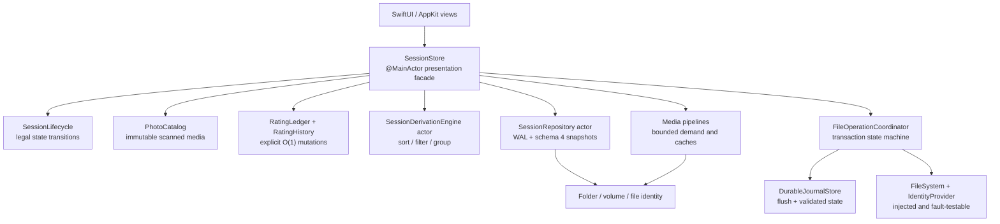

# Louppe codebase audit — 2026-07-31

Audited revision: `87a768f70e6e4b64c0c3d0ae358736f0b3ed02ae`
(`main`, “Keep Grid clicks in place and refresh README”)

This is a fresh audit of the current code, not an update to the historical
2026-07-26 audit. It covers application source, session state, persistence,
filesystem transactions, media pipelines, SwiftUI/AppKit UI, accessibility,
tests, CI, packaging, updates, and a real launch against a disposable folder.

## Baseline evaluation: 7.1/10

Louppe is a strong small macOS application with unusually good engineering
intent. Its normal review workflow is fast, the Swift 6 build is clean, the
large-session index and selection design are thoughtful, high-resolution
rendering is genuinely bounded, and the repository documents its invariants
better than many commercial projects.

It is not yet “amazing” because file safety has to dominate the score. One
same-volume move-recovery branch can hard-delete the actual original when a
different file has appeared at the old source path. Cross-volume move recovery
is separately unable to recognize the moved file. Those are not theoretical
style concerns; they contradict Louppe's most important promise.

Without the safety defects, the everyday application is closer to an 8.3/10.
The immediate goal should be to make destructive operations boring,
transactional, exhaustively tested, and impossible to confuse by pathname.

| Area | Score | Evaluation |
|---|---:|---|
| File safety and recovery | 5.8 | Excellent intent and boundaries, but one stop-ship deletion bug plus cross-volume and durability gaps |
| Session integrity and persistence | 6.8 | Typed actor-based persistence, but continuous input can starve saves and identity is path-based |
| Core architecture | 7.5 | Strong pure index/selection extractions; the main store and models remain too broad and manually synchronized |
| Concurrency and performance | 8.0 | Strict Swift 6, bounded major pipelines, and good benchmarks; some main-actor stalls and unbounded queues remain |
| Tests and verification | 7.4 | Broad custom checks and clean builds, but important safety tests never reach the branch named by the test |
| UI and accessibility | 7.4 | Native, restrained, and considered; global key routing creates a destructive focus hazard |
| Build, update, and release | 7.3 | Reproducible package checks and signed Sparkle feed; no Developer ID notarization and a toolchain-documentation gap |
| Documentation and engineering discipline | 9.0 | Excellent invariants, ownership notes, and operational guidance |

## Improvement update — current working tree

**Post-improvement evaluation: 9.1/10.**

Four safety tranches were implemented and verified on 2026-07-31. This is a
meaningful improvement, not a cosmetic score change: the stop-ship deletion
path is closed, every mutable operation is bound to scan-time physical
identity, thrown-after-effect rollback preserves replacements and stops the
batch, raced-in checkpoint replacements are rejected, duplicate cleanup is
re-proved after quarantine, and ambiguous hard links fail before mutation.
Volume and folder identity survive remounts and renames, journals and sessions
follow an explicit power-loss flush order, continuous ratings have a bounded
save deadline, and schema 4 retains decisions across verified file/folder
renames and temporary absence. Raw sidecar compare-and-swap, identity-keyed
backups, monotonic snapshot generations, and an explicit legacy-migration gate
now prevent path reuse or clock changes from silently reassigning ratings.
A follow-up UI regression review restored control-independent hotkeys, made
every rapid rating click count, kept cold thumbnail rebuilding off the
view-transition path, removed redundant Grid geometry, and preserved the
shared Info panel across view switches. The final UI follow-up also removed
the system double-click wait from ordinary Grid selection while preserving
double-click-to-open and rubber-band selection. A second adversarial pass separated review
letters from native control navigation, protected selectable metadata and
VoiceOver chords, prevented control-origin drags from starting selection,
removed duplicate menu shortcut ownership, bound every media surface to a
scan-time content revision, and made corrupt or stale thumbnail caches fail
closed and self-heal where safe. The final adversarial pass made journal paths
byte-exact across Unicode normalization, carried the photographer's exact
Unicode export destination through validation and Copy/Move, serialized the
exact sidecar and backup lineage across Louppe processes, generation-guarded
asynchronous video callbacks, stopped playback before filesystem operations,
and verifies the entire archived app tree against the signed loose bundle.
Louppe is now a strong 9.1. Descriptor-bound file I/O, an atomic
exchange-and-verify protocol for noncooperating external sidecar editors, a
smaller state architecture, a rating WAL, broader end-to-end UI testing, and
notarized distribution still separate it from the exceptional tier.

| Finding | Current state | Implemented change |
|---|---|---|
| P0-1 Move recovery deletion | **Fixed** | Source identity is proved before any staged/destination original can be removed; replacement regression preserves both files and the journal |
| P1-1 cross-volume Move | **Substantially fixed** | UI and worker reject unknown/mixed/cross-volume Move; the worker revalidates its source and uses exclusive POSIX rename, which cannot copy/delete or overwrite a late collision; Copy remains available |
| P1-2 Copy recovery | **Fixed for identified failures** | Missing, replaced, or in-place-rewritten sources preserve every copy; exact temporary ownership, state, and extended identity are required before removal |
| P1-3 scan-time file identity | **Substantially fixed** | Scanner captures volume/inode/size/birth/mtime/ctime for every physical file; every worker carries it into the immutable plan and rejects replacements before activation or immediately before each mutation; descriptor-relative I/O remains |
| P1-4 thrown-side-effect reconciliation | **Fixed for identified calls** | Copy partials, Trash, restore, staged/final renames, and rollback reconcile by exact identity; ambiguous ownership preserves every path, stops later work, and retains recovery evidence; checkpoints independently compare the worker-proven identity |
| P1-5 power-loss ordering | **Substantially fixed** | Shared POSIX boundary syncs plans/checkpoints, copied media, rename/removal directories, commit records, sidecars, and backups in write/sync/rename/directory order; destination names flush first and active journals retire atomically before cleanup; actual hardware-cut fault injection is still absent |
| P1-6 rating durability | **Substantially improved** | Five-second maximum dirty age, trailing save, verified slow-write coalescing, same-folder/quit barriers, monotonic generations, and one stable-folder lock spanning exact sidecar/backup CAS, replacement, fallback, and lineage update; a rating WAL and atomic exchange against a noncooperating external editor remain |
| P1-7 filename pairing | **Fixed conservatively** | Exact filesystem bytes and parent identity; ambiguous groups stay separate; schema 3 requires canonical ASCII percent-encoded IDs, rejects malformed or overlapping paired identities, and migrates byte-distinct legacy Unicode ratings independently |
| P1-8 global key routing | **Fixed and regression-tested** | Exact session/key window plus modal/sheet/presentation/selectable-text gates; ordinary controls retain native Space/Tab/Escape/arrows without stranding review letters, VoiceOver/Fn/Help chords pass through, one session-local monitor owns Command actions, and mounted SwiftUI focus tests cover the responder boundary |
| P1-10 second-process recovery | **Fixed** | Exclusive advisory lock spans every operation/recovery transaction; stale journals and inspection errors block new work; plan v3 stores exact filesystem bytes for every manipulated and resolved Trash pathname, makes them globally disjoint and outside journal storage, rejects unsafe hard-link/inode aliases, and binds commit markers to the operation ID plus the SHA-256 digest of the immutable raw plan bytes while authentic v1/v2 journals remain readable |
| P1-11 Trash replacement | **Fixed for identified failure** | A source path is accepted only when its planned identity matches; conflicts remain retryable |
| P1-9/P1-12 persistent identity | **Substantially fixed** | Schema 4 binds ratings to stable physical-file evidence; each open is also bound to directory volume/inode/birth identity and exact sidecar bytes. Identity-keyed backups, monotonic generations, scan revalidation, and explicit legacy consent prevent silent wrong-card migration. Open directory descriptors and a stronger content fingerprint remain |
| P2-12 malformed metadata | **Fixed** | Total, field-specific validation rejects nonfinite, unrepresentable, and nonsensical duration, dimension, frame-rate, EXIF, and shutter values |
| P2-21 empty-session message | **Fixed** | Gallery and Grid share reason-aware states; Move-all is never described as Trash or undoable; Export and Clean Up cannot open without targets |
| P2-26 safety language | **Fixed** | Copy/Move/Trash and permanent Trash-emptying boundaries are stated accurately |

The updated working tree passed:

- strict Swift 6 complete-concurrency compilation with warnings as errors;
- 151/151 XCTest cases with no skipped cases, including mounted-window hotkey,
  native Grid control/drag, stale-media replacement, and real-media repeated
  Gallery/Grid transition regressions;
- 71/71 performance, persistence, export, recovery, and real-Trash checks;
- 9/9 scrollbar checks;
- 18/18 native-video checks;
- the complete `1.7.0 (9)` release build, signing, archive, and package
  preflight;
- a byte-for-byte executable/Info.plist match between the verified archive and
  `/Applications/Louppe.app`, followed by a real `-openFolder` launch that
  scanned 106 disposable images and wrote a verified schema-4
  `.louppe_session.json` carrying the required
  `percentEncodedFileSystemPath` marker and stable physical identities.

Latest 100,000-item debug smoke measurements were approximately 2.08 seconds
for a full camera-sort rebuild, 107 ms for default-index reuse, 191 ms for
filter/group projection, and 0.2 ms for one rating mutation. The mounted
real-media transition test—106 image files, multiple day groups, a cold distant
tail render, and five warm Gallery→Grid→Gallery cycles—completed in 0.873
seconds including its cold media wait, layout, and run-loop barriers.

The highest-priority remaining work is now:

1. Bind source/destination parents and source files to opened descriptors
   (`openat`/descriptor-relative copy, rename, and private quarantine) so a
   parent or leaf swap cannot redirect the final syscall; use an atomic
   exchange-and-verify protocol for noncooperating sidecar edits (P1-3/P1-9).
2. Stream Copy into an exclusively created, identity-checkpointed partial and
   add a rating write-ahead log; move O(n) snapshot construction off the main
   actor (remaining P1-6/P2-9/P2-17).
3. Consolidate workers into one injected transaction engine, add conservative
   legacy cross-volume journal recovery, and split `SessionStore`/`Models.swift`
   around explicit state machines (P2-1/P2-7/P2-8).
4. Add hardware-cut/filesystem fault injection, increase production line and
   branch coverage, and exercise full UI flows under VoiceOver/focus changes.
5. Add Developer ID signing/notarization and automate the release provenance
   chain before presenting Louppe as a polished consumer download.

## Baseline verification record

All of these checks passed on the audited revision:

- Strict Swift 6 build with complete concurrency checking and warnings treated
  as errors.
- Full release build of Louppe `1.7.0 (9)`, including the package preflight and
  archive verification.
- 38/38 XCTest cases with zero failures.
- 61/61 deterministic performance, persistence, recovery, export, and
  real-Trash checks with zero failures.
- 9/9 scrollbar checks.
- 18/18 native video checks.
- A clean copy of the freshly built application launched with `-openFolder`,
  scanned a disposable image folder, and wrote a valid schema-2
  `.louppe_session.json`.

The current 100,000-item debug checks measured approximately:

- full camera-sort rebuild: 1.96 seconds;
- default-index reuse: 105 ms;
- filter and grouping: 186 ms;
- one rating mutation: 0.2 ms.

These numbers are useful smoke measurements, not release performance gates.
They also omit the delayed O(n) persistence snapshot after a rating.

XCTest coverage instrumentation reports 19.3% line coverage across production
sources. That number does not include the separate custom executable's
coverage, but it exposes an important structural problem: in the XCTest suite,
`CleanUpWorker`, `ExportWorker`, `FolderScanner`, and
`ExportDestinationValidator` have 0% line coverage, while
`FileOperationJournal` has 3.4%. The safety checks need to move into a
coverage-visible, parameterized test target.

Two environment observations matter:

- The selected Apple Command Line Tools build Louppe, but the current
  installation does not provide XCTest to `swift test`; XCTest succeeds when
  `DEVELOPER_DIR` points at Xcode 26.6. The working tree now states that
  distinction explicitly in `AGENTS.md`.
- The build script correctly verifies a clean temporary app and the release
  archive. The loose `dist/Louppe.app` can acquire File Provider extended
  attributes after it lands in Documents and then fail a later strict
  signature check. The zip should be treated as the canonical release
  artifact, or the loose app should live outside File Provider storage.

The latest public GitHub release is `v1.6.0`; `1.7.0 (9)` is already the open
work-in-progress release cycle, so this report does not require another version
bump.

## What is already excellent

These choices should be preserved while the internals are strengthened:

- One `@MainActor` `SessionStore` is the SwiftUI-facing source of truth.
- `PreparedSessionIndex` and `SelectionState` are pure, stable-ID-based
  authorities with explicit rebuild/remapping rules.
- Grid and Browser stay lazy, use stable identities, and defensively
  bounds-check indices.
- The Browser row directly observes the store and keeps `.id(item.id)`, which
  protects the documented lazy-row refresh behavior.
- Rating counts update incrementally; a single rating does not rebuild the
  100,000-item index.
- Image decoding is deduplicated and bounded; embedded-thumbnail fallback
  avoids blurry previews.
- Actual-size rendering is source-pixel tiled, keeps the viewport alive across
  photos, and has a real 128 MiB decoded-tile ceiling.
- Copy, Move, Trash, and restore are isolated in workers rather than performed
  on the main actor.
- One shared active-operation state blocks overlapping in-process mutations.
- RAW+JPEG export collision planning and pair-level rollback are directionally
  correct.
- Persistence uses an actor, typed outcomes, schema validation, ordered writes,
  atomic replacement, and a visible backup/failure path.
- The Sparkle dependency is checksum-pinned; the current appcast is signed,
  and publishing preflight requires and verifies the release archive's EdDSA
  signature.
- Swift 6 complete concurrency checking passes with zero warnings.
- There are no obvious force-cast, force-try, or force-unwrap habits in the
  production source.
- The macOS 26 toolbar correctly lets the system own Liquid Glass, uses native
  `ToolbarSpacer(.fixed)`, and avoids custom blur/glass wrappers. Do not replace
  this with hand-built glass or custom equal-width spacer views.

## Priority definitions

- **P0 — stop ship:** can permanently destroy or misidentify an original.
- **P1 — before the next public release:** material data-integrity or
  destructive-action risk.
- **P2 — next reliability milestone:** correctness, architecture,
  accessibility, and predictable performance.
- **P3 — excellence work:** polish, localization, release trust, and tooling.

The detailed findings below preserve the evidence and recommendations from the
audited baseline. The implementation table above is the authoritative current
status for items changed in this working tree.

## P0 — stop-ship finding

### P0-1 — Same-volume Move recovery can hard-delete the real original

Evidence:

- [`FileOperationJournal.recoverMove`](../Sources/Louppe/FileOperationJournal.swift#L423-L465)
  treats the existence of any file at `sourcePath` as proof that the original
  is safe.
- In the `sourceExists` branch, it never verifies the source identity.
- It then verifies that the temporary/destination file *is* the planned
  original and calls `removeItem` on it.

Deterministic failure sequence:

1. Move an original to a final destination on the same volume, preserving its
   filesystem identity through the rename.
2. Terminate Louppe after the completed checkpoint but before the journal is
   committed.
3. Create a different same-named file at the old source path.
4. Launch recovery.
5. Recovery sees that “the source exists,” hard-deletes the verified moved
   original, keeps the unrelated replacement, and removes the operation
   journal.

This directly violates “nothing ever hard-deletes” and the stable-identity
recovery invariant.

Required fix:

1. Verify the identity at the source before taking the `sourceExists` branch.
2. If it differs from the plan, classify the state as an identity conflict.
3. Leave source, temporary, and destination untouched and keep the journal
   retryable.
4. Use `state.resolvedIdentity` to prove ownership of staged/destination files.
5. Never delete a verified moved original merely because some pathname exists
   at its former source.
6. Put the rule in one transaction engine invariant:

   > A recovery action may remove a verified copy only after it has proved that
   > another complete copy of the same planned file is durable at the
   > conservative location.

Mandatory regression:

- Reproduce the five steps above.
- Assert that both files remain byte-for-byte unchanged.
- Assert that recovery reports a conflict.
- Assert that the journal remains available for retry.
- Repeat for the temporary and final-destination phases and for both members of
  a RAW+JPEG pair.

Do not release Move again until this test fails before the fix and passes after
it.

## P1 — data-safety and integrity findings

### P1-1 — Cross-volume Move recovery compares the wrong identity

Move records the destination-volume identity when staging/completing at
[`ExportWorker.swift:369`](../Sources/Louppe/ExportWorker.swift#L369) and
[`ExportWorker.swift:389`](../Sources/Louppe/ExportWorker.swift#L389).
Recovery ignores that identity and compares the temporary or destination file
to the original source-volume device/inode at
[`FileOperationJournal.swift:442-463`](../Sources/Louppe/FileOperationJournal.swift#L442-L463).

A cross-volume move necessarily creates a new filesystem identity. A crash
after the source leaves its volume therefore strands the original in the hidden
temporary path or destination and leaves recovery unresolved.

Immediate mitigation:

- Disable cross-volume **Move** while preserving **Copy**, or explicitly warn
  that Move is unavailable across volumes.

Correct design:

1. Copy source to an exclusively-created destination-volume temporary file.
2. Flush and verify the temporary file.
3. Durably checkpoint its new identity and fingerprint.
4. Remove the source only after that checkpoint is durable.
5. Sync relevant parent directories.
6. Atomically rename the temporary file to its final destination.
7. Recover using the identity appropriate to each phase.

Test on two mounted APFS disk images and terminate before and after every
checkpoint and filesystem mutation.

### P1-2 — Copy recovery can delete the only currently accessible copy

[`recoverCopy`](../Sources/Louppe/FileOperationJournal.swift#L389-L420)
removes temporary/final copies without first proving that the original source
still exists and matches the planned identity. A staged/final copy may be
identity-verified, but a temporary path in `.started` state—or with missing
staged identity data—can be removed based on its generated pathname alone. If
the source volume is unavailable, the source was externally removed, or a
replacement occupies the path, recovery can delete the only currently
accessible copy and potentially the only surviving intact copy if the source
volume is lost or damaged.

Fix:

- Before deleting any copy, prove a matching source is complete and durable.
- If source identity is missing, unavailable, or different, preserve every
  copy and keep recovery unresolved.
- Validate the canonical temporary parent, operation ID, file index, state,
  identity, and content fingerprint before deletion.
- Create and journal the temporary inode before writing into it; do not trust a
  generated filename alone.

Tests must cover a missing source, replacement source, disconnected source
volume, corrupt state, and a replacement at the temporary path.

### P1-3 — The file acted on is not tied to the file the photographer reviewed

**Improvement status:** Substantially fixed in the current working tree.
`FolderScanner` captures physical identity for every file, schema 4 persists
it, and every worker requires that identity at activation and immediately
before mutation. A journal checkpoint now independently compares the exact
identity the worker proved, mutating operations reject externally hard-linked
sources, and a post-metadata plus post-persistence restat blocks scan races.
The remaining hardening is descriptor-relative I/O, which would make even a
parent-directory or final leaf swap unable to redirect a syscall.

[`PhotoFile`](../Sources/Louppe/Models.swift#L72-L170) stores path, size, and
modification date, but not a stable scan identity. The operation journal
captures whichever file occupies the path when the entire batch starts, and
the worker does not revalidate it immediately before that file's turn.

In a long batch, an external process can replace a source after planning but
before Copy, Move, or Trash. Louppe then operates on the replacement and
records its identity as a successful completion.

Fix:

- Add a `ScannedFileIdentity` to every physical file: persistent volume ID,
  filesystem resource ID where trustworthy, creation/birth data, size,
  high-resolution modification time, and a conservative content fingerprint.
- Refuse destructive work if the current source differs from the reviewed
  identity; ask for a rescan.
- Revalidate through a no-follow file descriptor immediately before and after
  every original-affecting call.
- Use strong `PhysicalFileID`, `ProjectedItemID`, and `FolderID` types instead
  of interchangeable strings.

Tests need a controllable barrier that replaces the second source after plan
activation but before its operation begins.

### P1-4 — Filesystem errors are assumed to have no side effects

**Improvement status:** Fixed for the identified filesystem calls. Live Copy,
Move, Trash, restore, and rollback now reconcile all candidate locations by
identity after an error. A path replacement is never removed or overwritten;
ambiguity stops the batch and leaves the journal recoverable. Duplicate
cleanup transfers the candidate exclusively between two plan-owned paths,
captures fresh ctime-bound identities, repeats byte comparison after that
quarantine, and uses a nonrecursive unlink. The final proof-to-unlink syscall
gap still needs a private descriptor-bound quarantine.

Workers update their internal “touched location” only after
`copyItem`, `moveItem`, `trashItem`, or restore returns success. Filesystem
calls can throw after creating or moving an entry. In that case rollback can
incorrectly conclude that nothing happened, commit the journal, and leave an
untracked partial or moved file.

Relevant paths:

- [`ExportWorker.swift:181-216`](../Sources/Louppe/ExportWorker.swift#L181-L216)
- [`ExportWorker.swift:352-399`](../Sources/Louppe/ExportWorker.swift#L352-L399)
- [`CleanUpWorker.swift:89-125`](../Sources/Louppe/CleanUpWorker.swift#L89-L125)
- [`CleanUpWorker.swift:232-266`](../Sources/Louppe/CleanUpWorker.swift#L232-L266)

Fix:

- After every thrown filesystem call, reconcile all planned locations by
  verified identity before deciding success, failure, or rollback.
- Treat ambiguity as inconsistent, retain the journal, and do not continue the
  batch.
- Revalidate every remembered rollback target immediately before removing or
  moving it. Current live Export rollback trusts the path, so an external
  same-path replacement between the successful operation and rollback could be
  deleted or moved.
- Verify rollback postconditions; absence at one guessed path is not proof of
  safety.
- Inject a `FileSystem` abstraction that can deliberately “throw before side
  effect” and “throw after side effect.”

### P1-5 — Atomic journal writes are not power-loss durable

**Improvement status:** Substantially fixed. `DurableFileIO` now implements
write/sync/atomic-replace/directory-sync ordering for plans, step records,
commits, sidecars, and backups. Workers sync copied media and affected
rename/removal directories before advancing checkpoints. Cross-directory
renames flush the destination before the source, and committed journals leave
the active namespace through an exclusive, root-synced `.retired` rename
before cleanup. Bounded no-follow reads reject symlinked or oversized journal
records. A hardware power-cut fault-injection harness remains desirable
evidence, but the implementation now expresses the intended OS durability
contract.

The journal uses atomic `Data.write` and rename at
[`FileOperationJournal.swift:108-133`](../Sources/Louppe/FileOperationJournal.swift#L108-L133)
and
[`FileOperationJournal.swift:205-243`](../Sources/Louppe/FileOperationJournal.swift#L205-L243),
but it never flushes journal files or parent directories. Atomic replacement
prevents a torn file; it does not guarantee ordering across a sudden power
loss.

Create a `DurableJournalStore` that:

- writes a temporary record;
- calls `fsync` or `F_FULLFSYNC`;
- renames it atomically;
- syncs the parent directory;
- syncs operation activation and the journal root;
- flushes copied media before recording it as staged;
- documents guarantees and conservative fallbacks for APFS, exFAT, FAT, and
  network volumes.

Process-kill tests are still valuable, but they do not prove power-loss
durability. Until the flush/ordering contract exists, comments and the
`1.7.0` changelog should call this **process-crash recovery**, not
**power-loss recovery**.

### P1-6 — Fast continuous culling can remain unsaved indefinitely

**Improvement status:** Substantially fixed. Rating saves now have a five-
second maximum dirty age plus a trailing checkpoint, slow writes coalesce to
one newest snapshot, same-folder reopen and Quit cross an awaited barrier, and
current snapshots receive actor-assigned monotonic generations only after one
durable copy succeeds. The remaining excellence work is an append-only rating
WAL and moving the O(n) snapshot construction itself off the main actor.

[`SessionStore.scheduleSave`](../Sources/Louppe/SessionStore.swift#L1922-L1929)
is a trailing-only 500 ms debounce. Every rating cancels and restarts the save.
A photographer rating faster than two images per second can work for minutes
or hours without a durable checkpoint, so a crash can lose the entire
uninterrupted run.

The same persistence boundary has a second hole:
[`openFolder`](../Sources/Louppe/SessionStore.swift#L735-L766) saves before
opening a *different* folder but not before manually reopening the same folder.
`beginOpeningFolder` then clears the in-memory items. A rating made inside the
debounce window can be reloaded from the older sidecar and disappear.

Fix:

- Add a maximum dirty age: throttle regular checkpoints while input continues,
  plus one trailing save when activity stops.
- Prefer an append-only rating write-ahead log owned by the persistence actor,
  compacted periodically into the sidecar.
- Route every session transition, including same-folder open and launch-argument
  re-open, through one persistence barrier.
- Keep O(n) snapshot construction off the main actor.

Acceptance tests:

- Continuous ratings beyond the maximum dirty interval produce checkpoints.
- A crash replays every acknowledged rating from the journal.
- Same-folder reopen inside 500 ms preserves the rating.
- Older writes completing late cannot supersede newer revisions.

### P1-7 — Filename folding can pair unrelated RAW and JPEG files

[`FolderScanner.pairFiles`](../Sources/Louppe/FolderScanner.swift#L198-L260)
uses both case-insensitive and diacritic-insensitive folding on
case-insensitive volumes. `cafe.NEF` and `café.JPG` can exist as distinct files
yet collapse to one key and become a pair. Rating or destructive work can then
affect an unrelated photograph.

[`caseSensitiveNames`](../Sources/Louppe/FolderScanner.swift#L318-L322) also
defaults to case-insensitive when capability detection fails, which is the
unsafe direction.

Fix:

- Preserve diacritics.
- Apply only the case policy that the volume explicitly reports.
- Treat unknown capability as case-sensitive.
- Centralize this in a tested `VolumeFilenamePolicy`.
- Never assume canonical Unicode equivalence unless the specific filesystem
  policy proves those byte spellings identify the same directory entry.

Test case-only names, accented names, composed/decomposed Unicode, unknown
volume capability, and real case-sensitive/case-insensitive filesystems.

### P1-8 — App-wide key routing can invoke no-confirmation Trash in another window

**Improvement status:** Fixed. Routing proves the exact session/key window and
checks presentations, text editing, selectable text, native control focus, and
VoiceOver ownership before interpreting input. Non-text controls keep their
native navigation keys without disabling review letters; a single
session-local monitor owns Command actions, and mounted-window tests cover the
real SwiftUI responder boundary.

[`SessionView`](../Sources/Louppe/Views/SessionView.swift#L393-L537) installs an
application-wide local key monitor. It does not prove that the session window
owns the event, and its text-input check occurs after Command-Z,
Command-Delete, and Command-A.

Concrete consequences:

- Command-Delete in the source-folder panel can Trash the session selection
  behind the panel. The Export destination panel is currently protected by
  `isExportPresented`, but should remain in the regression matrix.
- Command-Z/A in selected metadata text can undo/select media instead.
- Settings, About, or Sparkle can mutate the hidden session.
- permissive modifier matching accepts undocumented combinations;
- during a file operation, non-Command keys—including VoiceOver
  Control-Option navigation—are swallowed before sheet/focus checks.

Fix:

- Scope routing to the exact session `NSWindow`.
- Pass through all events when another window is key, a modal window or sheet
  is present, or an actual text editor owns input. A focused non-text control
  must not strand the photographer's session-wide culling keys.
- Normalize `.deviceIndependentFlagsMask` and match exact documented modifier
  sets.
- Put focus/presentation checks before every command.
- Extract a pure `SessionKeyRouter(event, context) -> Command?`.

Acceptance tests need real `NSWindow` contexts for Settings, About, Sparkle,
source/destination panels, text editing, an active Export sheet, Shift-Tab,
and VoiceOver modifier chords.

### P1-9 — Path-based session and volume identity can apply or reject ratings incorrectly

**Improvement status:** Substantially fixed by schema 4 plus the current folder
access contract. Ratings follow exact physical files and verified folder
moves, same-path replacements block without rewriting either saved copy, and
missing entries remain dormant until the file returns. Each open captures the
directory's stable volume/inode/birth identity, backups use that key, the raw
sidecar digest is compared again immediately before replacement, and scan/file
identity is revalidated after metadata and persistence work. Old path-keyed
backups are considered only when both current locations are absent. Filename-
only schema 1–3 ratings require explicit consent before migration. The narrow
check-to-rename syscall race, persistent descriptor/bookmark ownership, stale
backup retirement, and a stronger content fingerprint remain.

Persistence backup identity is an FNV hash of `folder.path`, and a snapshot is
validated against that path:

- [`SessionPersistence.readCandidate`](../Sources/Louppe/SessionPersistence.swift#L211-L241)
- [`SessionPersistence.backupSessionURL`](../Sources/Louppe/SessionPersistence.swift#L275-L284)
- [`SessionStore.finishScan`](../Sources/Louppe/SessionStore.swift#L988-L1015)

This creates two opposite failures:

- Rename or move a folder carrying its valid sidecar and Louppe blocks it as a
  different source.
- Mount a different removable card at the same `/Volumes/...` path with the
  same relative filenames and Louppe can apply an earlier card's backup
  ratings.

Schema 4 now stores the volume/file identity portion of this plan. The current
persistence actor also stores an optional monotonic snapshot generation and
uses exact raw-byte hashes for compare-and-swap. Remaining work is to pin the
opened directory through a descriptor/bookmark, make the final CAS one atomic
exchange-and-verify transaction, and add a conservative content fingerprint
for filesystems whose inode metadata is weak.

Accept a same-identity rename/move. For copied folders or conflicting evidence,
offer a reviewed import; never silently reuse ratings by pathname alone.

### P1-10 — A second app process can recover a live first process

There is no interprocess lock around journal creation, execution, or recovery.
A second Louppe instance can interpret the first instance's active journal as
an interrupted operation and start “recovering” it.

Fix:

- Hold an exclusive advisory lock on the Operations root for the entire
  operation/recovery lifetime.
- If the lock is held, do not inspect or recover journals.
- Add `LSMultipleInstancesProhibited` as a UX defense, while keeping the lock
  as the correctness mechanism.
- Add a two-process integration test.

### P1-11 — Trash recovery can strand the original and accept a replacement

[`recoverTrash`](../Sources/Louppe/FileOperationJournal.swift#L467-L503)
treats the mere presence of `sourcePath` as success when no resolved Trash
destination was checkpointed.

Failure sequence:

1. `trashItem` moves the planned original to Trash.
2. Louppe terminates before recording the resolved Trash URL.
3. A different same-named file appears at the source path.
4. Recovery sees that the source pathname exists, accepts it without identity
   verification, and removes the operation journal.
5. The real original remains stranded in Trash with its recovery relationship
   forgotten.

Verify the source identity before accepting it. If the destination checkpoint
is missing, search only by a durable operation/file identity—not by
filename—or leave the operation unresolved and give the user a conservative
recovery workflow. Test replacement-at-source before and after every
`trashItem` checkpoint.

### P1-12 — Journal identity is not stable enough for reconnect-and-retry

**Improvement status:** Substantially fixed. New identities carry stable volume
UUID, inode, size, birth, modification, and status-change timestamps. When a
UUID is present, a remount-sensitive root path/device number no longer defeats
matching. Legacy journals retain their conservative fallback.

[`FileIdentity`](../Sources/Louppe/FileOperationJournal.swift#L53-L58) is an
absolute volume-root path plus device number and inode. After reboot or
removable-volume reconnect, mount paths and device numbers can change. Inodes
can be reused, and FAT/exFAT/network filesystems may expose weaker identities.
The promised “reconnect the drive and retry” flow can therefore stay
permanently unresolved or, in the worst case, identify the wrong reused file.

Store persistent volume UUID/identifier and volume-relative paths. Combine the
best available file resource ID with birth metadata, size, and a content
fingerprint; use a conservative hash-backed policy when a filesystem cannot
provide a trustworthy persistent ID. Test detach/reattach, changed mount name,
reboot, inode reuse, exFAT, and unavailable identity attributes.

## P2 — correctness and architecture findings

### P2-1 — Replace several filesystem workers with one transaction engine

The immediate fixes should not become another layer of branch-specific
conditionals. Build a single `FileOperationCoordinator` with explicit
transaction states and shared rules for Copy, Move, Trash, and restore.

Each physical file should move through a durable state machine resembling:

| Phase | Required proof before advancing |
|---|---|
| planned | Reviewed source identity still matches |
| temporary-created | Exclusive owned temporary identity is journaled |
| bytes-written | Size/content verified and media file flushed |
| staged | New identity/fingerprint checkpoint and directories flushed |
| source-removed | Only for Move/Trash, after a durable verified copy exists |
| destination-renamed | Final identity and canonical parent verified |
| completed | Pair-level postcondition holds |
| committed | Every planned item has a safe final state |

Recovery should derive an action from verified observed state, not infer
ownership from a filename or a successful/failed API return.

Add typed outcomes for source changed, volume unavailable, permission denied,
identity conflict, corrupt journal, insufficient capacity, partial side
effect, and retryable restore.

### P2-2 — Corrupt recovery metadata does not consistently fail closed

[`readState`](../Sources/Louppe/FileOperationJournal.swift#L642-L647) maps a
missing state and malformed JSON to the same `nil`. A filename called
`committed` is trusted without tying it to the plan. Plan validation does not
reject duplicate/conflicting paths or invalid state relationships. Failure to
enumerate the journal root can be treated as “nothing pending.”

Return `.absent`, `.valid`, or `.corrupt`; keep corrupt operations unresolved
and untouched. Add operation ID, index, plan digest, and transition version to
every state and commit record. Semantically validate the entire plan before
touching media.

### P2-3 — Current “pair rollback” tests do not execute rollback

The fixtures named:

- [`cleanUpPairFailureRollsBackFirstFile`](../Tests/PerformanceChecks/main.swift#L867)
- [`exportCopyPairRollsBackOnPartialFailure`](../Tests/PerformanceChecks/main.swift#L974)
- [`exportMovePairRollsBackOnPartialFailure`](../Tests/PerformanceChecks/main.swift#L1075)

remove the second source before journal startup. Because journal planning
captures every source identity up front, the entire operation aborts before
the first file is touched. The tests pass without testing the rollback loops.

Inject a checkpoint hook or fake filesystem so the second member fails *after*
the first member changes location. Assert the exact pair postcondition and
journal state.

### P2-4 — Failed Trash undo discards retry information

Undo removes the cleanup entry before restore starts, and a startup/restore
failure can clear the entire undo stack. A disconnected card, permission
problem, or temporarily unavailable Trash volume can therefore be presented as
possible deletion while Louppe forgets how to retry.

Preserve unresolved `RemovedPhoto` records, distinguish retryable/unavailable
from confirmed missing, store Trash identity with its URL, and persist the most
recent cleanup undo manifest across relaunch.

### P2-5 — Destination validation should return a durable capability

[`ExportDestinationValidator`](../Sources/Louppe/ExportDestinationValidator.swift)
uses path strings, does not return the canonical identity it validated, and
uses only the first source file's volume for capacity decisions. A recursive
source may contain mount points, and a symlink destination can change after
validation.

Return a `ValidatedDestination` containing:

- canonical URL and directory resource identity;
- persistent volume ID and capabilities;
- validation timestamp/token;
- per-file cross-volume capacity requirement using current sizes and headroom.

Revalidate immediately before plan activation. Compare filesystem identities
and path components, not string prefixes. Treat dangling symlink entries as
occupied.

### P2-6 — Structural session state is too easy to mutate incorrectly

`phase`, `items`, and `currentIndex` are broadly settable inside the module,
while cached indices, facets, groups, selection, tallies, and current item must
change together. The repository already records a crash caused by
`visibleIndices` outliving `items`.

Make structural properties `private(set)` and expose one transactional
`installSession`/`replaceContent` operation. Add a DEBUG validator that checks:

- every projected index is in range;
- visible groups concatenate exactly to visible indices;
- location maps are bijective;
- selected IDs match projected indices;
- physical-file and projected-item IDs are unique;
- rating tallies equal the ledger;
- current item is valid and visible.

### P2-7 — `SessionStore` and `Models.swift` have crossed the useful-size boundary

Current large files include:

- `SessionStore.swift`: 2,167 lines;
- `Models.swift`: 1,087 lines;
- `FilterView.swift`: 851 lines;
- `FileOperationJournal.swift`: 702 lines.

Size alone is not the defect; mixed ownership is. `SessionStore` owns lifecycle,
ratings, history, filtering, navigation, persistence coordination, cleanup,
export, recovery, recents, and transient presentation. `Models.swift` combines
catalog entities, mutable rating storage, filtering, sorting, cleanup/export
state, display formatting, and persistence DTOs.

Split behind the existing single observable facade:

- `SessionLifecycle` — legal phase/operation transitions;
- `PhotoCatalog` — immutable scanned physical files and projections;
- `RatingLedger` and `RatingHistory` — explicit mutation and bounded undo;
- `SessionDerivationEngine` — sort/filter/group immutable results;
- `SessionRepository` — schema, rating WAL, snapshot compaction;
- `FileOperationCoordinator` — the transaction engine;
- `MediaFormatRegistry` — capabilities and format classification;
- `FilterEditorModel` — typed drafts and validation.

Do not replace one store with a web of mutually observing view models.

### P2-8 — Interacting booleans should become legal state machines

`phase`, `activeFileOperation`, `isSessionTransitioning`,
`isRecoveringInterruptedOperations`, `recoveryNeedsAttention`, pending
cleanup, and presentation flags can represent illegal combinations.

Create associated-value enums such as:

```swift
enum SessionActivity {
    case idle
    case scanning(ScanProgress)
    case saving(SessionTransition)
    case fileOperation(FileOperationProgress)
    case recovering(RecoveryProgress)
    case recoveryBlocked(RecoveryIssue)
}
```

Derive button enablement, termination policy, updater postponement, overlays,
and allowed key commands from that state. Keep modal presentation state
separate but validate it against activity.

### P2-9 — Large derivations and persistence snapshots run on the main actor

`SessionStore` is `@MainActor`, and index rebuild/filter/group work plus the
full persistence snapshot are synchronous there. The 100,000-item measurements
show visible 100 ms–2 second work.

Introduce a `SessionDerivationEngine` actor that receives immutable inputs,
computes `PreparedSessionState`, and returns a generation-tagged result. Apply
only the newest generation on the main actor. Construct persistence payloads
in `SessionRepository`, not by walking every physical file on the UI actor.

Keep the immediate rating mutation O(1), then schedule off-main derivation or
serialization. Add optimized-build latency gates and latest-generation-wins
tests.

### P2-10 — Shared reference-backed ratings undermine value semantics

`PhotoItem`/`PhotoFile` values share lock-protected mutable rating storage.
This avoids copying the entire catalog, but copies silently share mutations and
the UI relies on manual `objectWillChange.send()` calls.

Prefer an immutable catalog plus an explicit `RatingLedger` keyed by
`PhysicalFileID`. `SessionStore` commands update the ledger, tallies, history,
and projections in one transaction. This makes snapshotting, testing,
concurrency, and publication behavior explicit without sacrificing O(1)
ratings.

### P2-11 — Scanner errors are silently omitted

[`FolderScanner.scan`](../Sources/Louppe/FolderScanner.swift#L112-L184) has no
enumeration error handler and uses `try?` for resource values. Unreadable
subfolders or disappearing files silently vanish; unknown size becomes zero.
The app can claim a complete scan and capacity checks can undercount.

Return `ScanResult(items, issues, skippedFileCount, skippedFolderCount)` with
typed permission, offline, corrupt, and metadata errors. Show a nonblocking
“scan incomplete” summary and let the photographer inspect skipped paths.
Progress should report enumeration, metadata, pairing, and sorting phases with
time-based throttling.

### P2-12 — Media metadata needs total, sanitized domain types

Several numeric paths can trap on malformed/extreme metadata:

- duration converts directly to `Int`;
- video dimensions convert directly to `Int`;
- very small shutter times can produce an infinite reciprocal and then convert
  to `Int`;
- some EXIF values admit nonfinite numbers.

Centralize validation into total types such as `MediaDuration`,
`PixelDimensions`, `Aperture`, `ShutterSpeed`, and `ISOValue`. Require finite,
representable, physically sensible values at the scan boundary. Formatters
must always return a fallback instead of trapping. Fuzz NaN, infinities,
subnormals, values beyond `Int.max`, and damaged media.

### P2-13 — Image/histogram cancellation and thumbnail writes need backpressure

Image and histogram waiters use continuations without removing canceled
consumers immediately. Prefetch creates detached work, and thumbnail disk
writes queue closures that retain decoded images. Disk pruning is now delayed
and throttled to one utility pass per day so it cannot contend with the first
view switch, but the documented 512 MiB cache is still not a hard runtime
ceiling between passes.

Fix:

- assign IDs to waiters and remove them in cancellation handlers;
- cancel queued work when the final consumer leaves;
- use one bounded generation-aware prefetch coordinator;
- encode before enqueueing optional disk writes or drop them under pressure;
- prune at a high-water mark to a lower target during runtime;
- coordinate memory pressure across preview, histogram, and tile caches;
- briefly negative-cache corrupt decode failures by file revision.

Test with tiny budgets and deliberately slow workers; assert maximum queue
length, retained bytes, disk size, and prompt cancellation.

### P2-14 — Blocking semaphore bridges should become structured async

[`VideoSupport.swift`](../Sources/Louppe/VideoSupport.swift#L24-L74) and video
thumbnail extraction in
[`ImagePipeline.swift`](../Sources/Louppe/ImagePipeline.swift#L241-L270) bridge
AVFoundation async APIs through detached tasks and blocking semaphores.
Timeout/cancellation does not reliably stop underlying work and blocked threads
reduce scanner concurrency.

Use async AVFoundation APIs, a bounded task group or async semaphore,
cancellation-aware timeout races, and typed failure reasons. Ensure a timed-out
probe cannot continue scheduling follow-up work.

### P2-15 — Cache and persistence identity are vulnerable to removable-volume reuse

**Improvement status:** Fixed for persistence backups. They are keyed by the
captured source-directory identity, and a legacy path-keyed backup is never
considered while a sidecar or identity-keyed backup exists. Legacy ratings
require explicit approval; schema-4 recovery still has to prove a physical
file. Derived media caches remain path/fact based and need the change below.

The image cache key is largely path plus modification date. Two removable cards
mounted at the same path with the same filename/time can reuse stale thumbnails.
The same family of path-identity problem previously affected rating backups.

Use the schema-4 physical identity/fingerprint for every derived cache:
thumbnail, histogram, fitted preview, high-resolution source, and persistence.
Include cache schema/version and file size; invalidate conservatively when
identity quality is weak.

### P2-16 — Snapshot ordering should not rely on wall-clock time

**Improvement status:** Fixed for every newly written current-schema snapshot.
`SessionPersistence` assigns and advances a monotonic generation only after a
sidecar or backup reaches durable storage, and compares that generation before
timestamps. Pre-generation snapshots retain timestamp ordering solely for
backward compatibility; the first current save upgrades both copies.

Sidecar and backup freshness is chosen using `scannedAt`, which is assigned
from `Date()` on save. Clock rollback can make a newer snapshot look older; a
future-dated stale backup can keep winning.

Persist a monotonic per-session revision and compare that first. Keep wall time
as informational metadata and add a payload hash for diagnosis.

### P2-17 — Persistence coordinator retains large completed requests

The store keeps pending persistence task/request references, and successful
completion does not clearly release the full payload. A 100,000-item snapshot
can remain retained unnecessarily.

Use an explicit persistence state:

- `.idle`;
- `.saving(sequence)`;
- `.failed(retrySnapshot)`.

Clear successful task/request payloads by sequence; retain a full snapshot only
when a failed save genuinely needs retry.

### P2-18 — Undo is bounded by action count, not memory

Up to 500 undo entries may each contain changes for every physical file.
Repeated Select All operations can retain millions of records.

Bound history by changed-record count or estimated bytes, skip no-op rating
targets, compact uniform batch operations, and preserve exactness for the
retained recent window.

### P2-19 — Capture chronology and time zones are not camera-accurate

Photo EXIF parsing uses the current system time zone and ignores
`OffsetTimeOriginal`; video chronology often falls back to filesystem creation
time instead of embedded QuickTime/asset creation metadata. Moving between
time zones or copying videos can regroup shoots under the wrong day.

Introduce `CapturedTimestamp(localComponents, offset, provenance)`:

- parse EXIF date, subsecond, and offset tags;
- read embedded video creation metadata;
- use filesystem dates only as an explicit fallback;
- preserve provenance for diagnostics and deterministic sorting.

### P2-20 — Format support should be capability-driven

Extension sets are static while the minimum system is macOS 14 and actual
ImageIO/AVFoundation support varies by OS and installed codecs.

Build a `MediaFormatRegistry` from ImageIO and AVFoundation capabilities at
launch. Distinguish “recognized but unavailable on this Mac” from corrupt or
unsupported files, and use the registry consistently in scanning, labels,
filters, and tests.

## P2 — UI, product language, and accessibility findings

### P2-21 — Empty-session messaging is wrong after Move

[`GalleryView`](../Sources/Louppe/Views/GalleryView.swift#L17-L28) says an empty
session means everything went to Trash and Command-Z will restore it. Move-all
also empties a session and is intentionally non-undoable.
[`GridView`](../Sources/Louppe/Views/GridView.swift#L59-L73) shows a blank
canvas for both cases.

Add `SessionEmptyReason.trashedUndoable` and `.movedOut(destination)` and one
shared empty-state view for Gallery and Grid. Disable Clean Up/Export when
there are no items. Test Trash-all, Move-all, and filter-zero separately.

### P2-22 — Metadata from the previous item is shown under the new filename

[`MetadataPanel`](../Sources/Louppe/Views/MetadataPanel.swift#L112-L151) waits
80 ms before loading without clearing/gating old fields. Navigation can show
photo A's camera/lens/exposure beneath photo B's filename. The task ID also
misses paired-file projection changes when the primary RAW ID stays the same.

Use a revision containing both physical-file IDs and modification dates. Render
fields only when `loadedRevision == requestedRevision`, show an explicit
loading state, and inject the loader/clock. Test late cancellation and
together/separate pair toggles.

### P2-23 — “100%” can silently remain a fitted preview

Actual-size source loading has no visible state. If source creation returns
`nil`, the canvas can continue showing the fitted preview while the UI still
claims actual size, with no retry.

Model `.idle`, `.loading`, `.ready`, and `.failed`; include source loading in
the activity counter. On failure, clearly say that Fit is being shown and
offer Retry/Return to Fit. Test delay, failure, cancellation, and retry.

### P2-24 — Zoom is not discoverable or fully accessible

Phone-size zoom is only bare `A`; actual size is `S` or double-click. Add a
native, checkmarked View-menu “Photo Size” group for Fit, Phone Size, and 100%.
This preserves the owner-approved toolbar grouping. Add VoiceOver actions to
inspect at 100%, return to Fit, and center the inspection point, plus a
keyboard-shortcuts help view.

### P2-25 — Filter range editing has a focus-order trap

An invalid From/To pair is restored as soon as focus moves, so changing both
bounds often works only in one edit order. The empty-label text fields are not
reliably distinguishable to VoiceOver.

Extract a typed `FilterEditorModel`. Preserve temporary invalidity while focus
stays inside a pair; validate on Submit, pair exit, valid debounce, or popover
close. Give every bound a programmatic label, invalid-state value, format help,
and tests for both edit orders, decimal comma, fractions, and duration input.

### P2-26 — Safety statements and comments are materially inaccurate

- [`WelcomeView`](../Sources/Louppe/Views/WelcomeView.swift#L44-L47) says
  “Originals are never changed,” despite explicit Move and Trash features.
  Prefer: “Export copies by default. Originals move only when you explicitly
  choose Move or Trash.”
- [`SessionView.cleanUpMessage`](../Sources/Louppe/Views/SessionView.swift#L92-L102)
  says moving to Trash frees the displayed space. Space is normally reclaimed
  only after Trash is emptied.
- The developer comment at
  [`SessionView.swift:352-354`](../Sources/Louppe/Views/SessionView.swift#L352-L354)
  says Clean Up is the only feature that can move originals, but explicit
  Export Move is the other sanctioned path. Describe Clean Up as the only
  Trash path, or as one of the two allowed move paths.

Safety copy is part of the product contract and must be exact.

### P2-27 — Modal/progress accessibility is incomplete

Recovery visually blocks content without reliably hiding the underlying
accessibility tree or moving focus. Scan, Cleanup, and Export progress changes
are not consistently announced; Export hierarchy changes can lose the
Stop Copying control; group headers lack header traits.

Use `@AccessibilityFocusState`, modal traits, hidden background content,
combined label/value progress elements, and throttled polite announcements.
Exercise the actual accessibility tree, not only helper strings.

### P2-28 — Display strings are used as program identity

Examples include detecting a pair through `"RAW + JPEG"` and identifying
metadata fields through English labels. Filter facets also merge missing
camera/lens with a literal `"Unknown"` value and root with a real folder named
`"None"`.

Create typed `MetadataField.Kind` and facet keys such as `.missing`, `.root`,
and `.value(String)`. Localize presentation separately. Add a Swift string
catalog, plural variants, and pseudolocalization tests.

### P2-29 — Rating filtering is promised but absent

The README says filters cover ratings, while `PhotoFilter` has no rating
criterion. Either correct the README or, preferably, add Yes/No/Undecided/Mixed
facets.

When a rating filter is active, rating can remove the current item. Implement
that as one transaction: snapshot visible location, change rating/tallies,
recompute visibility, remap current/selection, and preserve next-undecided
semantics. Test pair conflicts, batch rating, undo, and zero results.

## P3 — excellence and polish

### P3-1 — Add privacy-aware observability

`PreparedSessionIndex` has useful signposts, but scan phases, cache
hit/miss/eviction, persistence revisions, operation transactions, recovery,
and updater postponement lack a cohesive diagnostic story.

Add `Logger` categories and signposts with stable error codes. Redact full paths
by default. Offer a diagnostics export containing versions, capabilities,
counts, timings, error codes, and hashes—not image contents or raw paths unless
the user explicitly opts in.

### P3-2 — Make benchmarks enforce budgets

Current performance checks print timings but do not fail on gross regressions.
Run representative optimized builds and store machine/toolchain context. Gate
large regressions in:

- 1k/10k/100k index derivation;
- persistence snapshot construction;
- 100k batch rating/selection summary;
- rapid-navigation waiter counts;
- cache queue memory and disk ceiling;
- scan throughput and main-actor application;
- scrolling frame time/body invalidations.

Use broad, stable ceilings in CI and preserve trend data for local analysis.

### P3-3 — Improve test architecture, not just test count

Introduce injectable:

- `FileSystem`;
- `IdentityProvider`;
- `JournalStore`;
- `Clock`;
- `MetadataLoading`;
- `HighResolutionSourceProviding`;
- operation checkpoint hooks.

Then:

- enumerate every crash point before/after journal and filesystem mutations;
- assert the global invariant after every injected failure;
- add child-process kill tests and APFS cross-volume disk-image tests;
- use property tests for comparators, path validation, schema decoding,
  prepared-index bijections, and randomized selection transitions;
- run real Trash tests on a scheduled macOS job instead of skipping them in
  ordinary CI;
- add a nightly Thread Sanitizer stress suite for manually locked
  `@unchecked Sendable` types;
- add real-window key-routing and hosted accessibility-tree tests.

For safety code, branch/state-transition coverage matters more than a global
percentage. Require every transaction transition and recovery observation
combination to be exercised.

### P3-4 — Establish a project-specific format and lint policy

There is no formatter/linter configuration. The bundled formatter defaults do
not match the project's four-space style and produce unusable noise.

Add a checked-in `.swift-format` configuration, format only in a deliberate
mechanical change, and then gate it in CI. Add a small architecture lint for:

- original-affecting APIs outside the coordinator;
- direct writes to structural store state;
- force casts/tries/unwraps;
- unreviewed `@unchecked Sendable`;
- UI logic based on localized strings.

Pin third-party CI actions by commit SHA rather than a mutable major-version
tag.

### P3-5 — Finish the release trust story

The app is ad-hoc signed and explicitly not notarized, so users must work
around Gatekeeper. When practical:

- use Developer ID signing;
- enable hardened runtime;
- review and minimize entitlements;
- notarize and staple the release;
- keep Sparkle's Ed25519 signature;
- maintain an offline, encrypted backup of the Sparkle private key and
  periodically restore-test it.

Treat `dist/Louppe.zip` as canonical while the workspace is File
Provider-managed, or add an install/verify helper that copies to clean staging,
clears attributes, and verifies the exact installed app.

### P3-6 — Close small but real UI quality gaps

- Own the internally-created updater model with `@StateObject`, not
  `@ObservedObject`.
- Cache large multi-selection summaries by content/selection generation.
- Separate transient image/progress observation so unrelated store
  publications do not invalidate every visible Browser/Grid tile; preserve the
  current direct-observation correctness until measured.
- Use `.primary` rather than brand purple for small recent-folder text where
  contrast is marginal.
- Avoid stacking custom opacity on native disabled styling.
- Validate the custom scrollbar in Aqua, Dark, Increase Contrast, Reduce
  Transparency, and every system scrollbar setting.
- Rename “All Photos” to “All Items” or “All Media.”
- Distinguish recent folders with identical basenames.

## Recommended target architecture

Keep one simple observable facade for SwiftUI and move complex ownership behind
it:



The important boundaries are:

1. **UI actor:** publishes small presentation state and applies validated
   generation results.
2. **Immutable catalog:** describes exactly what was scanned and reviewed.
3. **Explicit rating ledger:** owns all mutable decisions and history.
4. **Derivation actor:** computes expensive immutable projections off-main.
5. **Repository actor:** guarantees bounded rating durability and schema
   migration.
6. **Transaction coordinator:** is the only code allowed to change originals.
7. **Filesystem adapter:** makes every failure boundary deterministic in tests.

## Ordered improvement plan

### Phase 0 — make the current release safe

1. Add the P0 reproduction and fix move recovery.
2. Disable cross-volume Move until the explicit copy/verify/delete transaction
   exists.
3. Make Copy recovery preserve the only verified copy.
4. Scope key handling so Command-Delete cannot reach the session from another
   window.
5. Remove diacritic-insensitive pairing and make unknown volume policy
   conservative.
6. Add maximum-dirty-age rating saves and protect same-folder reopen.
7. Add an interprocess operation lock.

Exit criterion: every acknowledged file operation preserves at least one
verified original through every injected crash/error point; no app-external
window can trigger a session mutation.

### Phase 1 — build the reliability foundation

1. Implement `FileOperationCoordinator`, `DurableJournalStore`, and injected
   filesystem/identity services.
2. Implement explicit cross-volume Move with flush and verification.
3. Add the next schema's folder/file identity and monotonic revisions.
4. Add the rating WAL and snapshot compaction.
5. Fail closed on corrupt journal state and reconcile errors after side
   effects.
6. Move safety scenarios into parameterized, coverage-visible tests.

Exit criterion: transaction-state coverage is complete, APFS disk-image crash
tests pass, reconnect/path-reuse scenarios are safe, and ratings have a defined
maximum loss window (preferably zero once acknowledged).

### Phase 2 — simplify state and remove UI stalls

1. Make structural store state private and transactional.
2. Extract lifecycle, catalog, rating ledger/history, derivation, repository,
   and filter editor.
3. Move O(n) derivation/snapshot work off-main with generation cancellation.
4. Add DEBUG invariant validation.
5. Add bounded cancellation/backpressure to image, histogram, video, and disk
   cache work.
6. Return structured scanner results and phase-aware progress.

Exit criterion: illegal state combinations are unrepresentable, common input
does not synchronously walk the full catalog on the main actor, and all
documented cache ceilings are enforced at runtime.

### Phase 3 — make the product feel finished

1. Correct empty states and safety language.
2. Fix stale metadata and actual-size failure states.
3. Expose zoom through native menus and VoiceOver actions.
4. Finish modal/progress accessibility and key-routing tests.
5. Add typed/localizable metadata and facets, including rating filters.
6. Add diagnostics, visual QA variants, formatting/lint gates, Developer ID
   signing, and notarization.

Exit criterion: every core workflow is understandable and operable with mouse,
keyboard, and VoiceOver; failures are visible and recoverable; the distributed
app opens without a Gatekeeper workaround.

## Definition of “amazing”

Louppe should not be called finished until these are true:

- No code outside one transaction coordinator can move or remove an original.
- Every filesystem mutation has a durable before/after checkpoint and stable
  identity proof.
- At every crash point, Copy retains a verified source or copy, and Move/Trash
  retain exactly one verified recoverable original.
- A pathname collision, remount, rename, symlink change, second process, or
  thrown-after-side-effect error cannot cause Louppe to touch an unowned file.
- Continuous culling cannot postpone durability indefinitely.
- A folder/card identity mismatch cannot silently inherit ratings.
- Scanner omissions are reported.
- Corrupt metadata cannot trap.
- Main-actor work stays below an explicit interaction-latency budget; large
  derivations are asynchronous and latest-generation-wins.
- Cache budgets are hard bounds, not launch-time aspirations.
- Every destructive transition and recovery observation has a deterministic
  test.
- Keyboard focus and VoiceOver can never accidentally trigger a hidden
  destructive action.
- The app is Developer ID signed, hardened, notarized, and distributed through
  a reproducibly verified archive.

## Final assessment

The foundation is worth investing in. Louppe does not need a rewrite, a new UI
framework, or a forest of view models. It needs one uncompromising filesystem
transaction engine, stronger identity and persistence semantics, and a thinner
main-actor facade.

Fix the P0/P1 items before adding broad features. Then extract around proven
ownership boundaries and keep the existing strengths: native macOS behavior,
stable IDs, lazy rendering, bounded source-pixel tiles, restrained Liquid
Glass, and clear repository invariants. That path can realistically move the
codebase from 7.1 to 9+ without sacrificing the product's simplicity.
