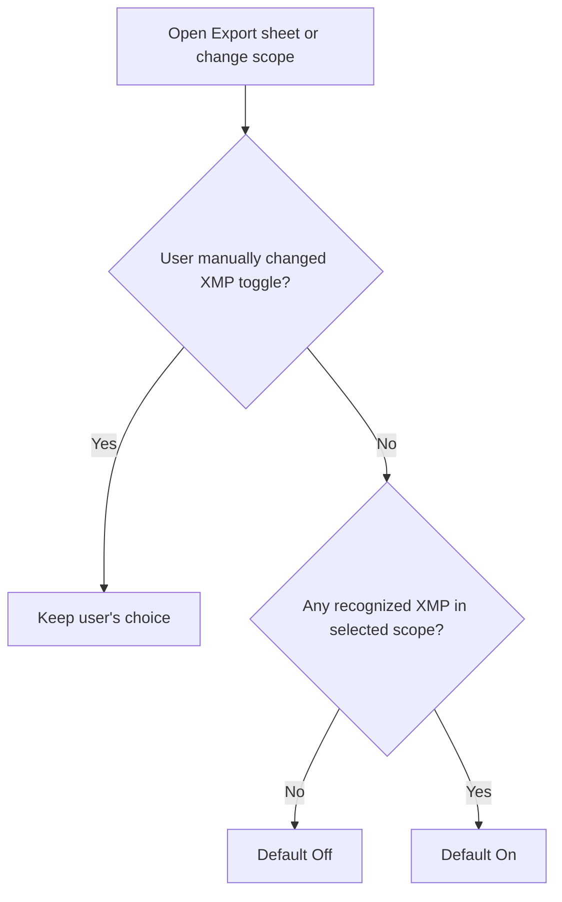

# Native Metadata and XMP Interoperability

## Implementation specification for Louppe

| | |
|---|---|
| Status | Implemented baseline; amended by `RAW_JPEG_XMP_EXECUTIVE_PLAN.md` |
| Audience | Coding agent implementing the feature on a separate branch |
| Last updated | 2026-08-07 |

---

## 1. Purpose

This document is the source of truth for the implemented XMP foundation and
all unchanged safety requirements. The later
`Docs/RAW_JPEG_XMP_EXECUTIVE_PLAN.md` supersedes it only for the default
RAW+JPEG projection, grouping-control wording/location, explicit same-stem
conflict resolution, and the additional verification those changes require.

This document defines:

- native 1–5 star ratings to Louppe;
- native color labels to Louppe;
- filtering and sorting for decisions, stars, and colors;
- safe XMP publication for Adobe Bridge, Lightroom Classic, Capture One, and darktable;
- XMP-aware Copy and Move exports;
- a standalone **Metadata (XMP)** export mode.

It combines the product decisions, interoperability research, data model, UI behavior, file-safety requirements, implementation order, tests, and final acceptance checklist. If an older note, mockup, or recommendation conflicts with this document, this document wins.

This feature is one-way publication in its first release: Louppe writes its current metadata to XMP. It does not yet import changes made by another application.

---

## 2. Product decisions

### 2.1 Three independent kinds of metadata

Every physical photo file has three independent metadata dimensions:

| Dimension | Louppe values | Purpose |
|---|---|---|
| Cull decision | Yes, No, Undecided | Louppe's quick keep/reject workflow |
| Star rating | Unrated, 1, 2, 3, 4, 5 | Portable quality rating |
| Color label | None, Red, Yellow, Green, Blue, Purple | Portable workflow/category label |

These dimensions must never silently overwrite one another.

In particular:

- Yes does not automatically mean 5 stars.
- No does not automatically mean 1 star or rejected.
- A red label does not automatically mean No.
- A green label does not automatically mean Yes.

Application-specific mappings may offer those conversions as explicit options, but they are never defaults and must clearly say which exported value they replace.

### 2.2 Portable color set

The first release supports exactly this shared set:

- None
- Red
- Yellow
- Green
- Blue
- Purple

This set is understood by Bridge, Lightroom Classic, Capture One, and darktable. Capture One also has Orange and Pink/Magenta, and darktable can attach multiple colors to one image, but those behaviors are not portable across all target applications and are excluded from Louppe's first implementation.

Louppe stores one color per physical file. The XMP writer emits the exact English `xmp:Label` strings `Red`, `Yellow`, `Green`, `Blue`, and `Purple`.

### 2.3 Louppe remains authoritative

`.louppe_session.json` remains the authoritative record while a folder is open in Louppe. XMP is a published interoperability copy, not a replacement for session persistence.

The first release does not continuously synchronize XMP and does not read external XMP edits back into Louppe. A user explicitly publishes metadata from the Export sheet.

### 2.4 Original media remains immutable

Louppe must never embed metadata into RAW, JPEG, TIFF, DNG, HEIC, PNG, or video files. It creates or updates separate `.xmp` files only.

This means compatibility is strongest for proprietary RAW files. Adobe applications commonly expect metadata for JPEG, TIFF, PSD, and DNG to be embedded in the media file. Louppe must still refuse to modify those originals; it may create a best-effort sidecar and clearly describe that the target application may ignore it.

Videos are excluded from XMP publication in the first release.

### 2.5 Why this matches established culling workflows

QuickRawPicker, FastRawViewer, and Photo Cull Pro all treat interoperable metadata publication as part of the handoff from culling to editing/archiving. Their exact mappings and overwrite policies differ, which is why Louppe must expose an application profile and preserve its independent native values rather than copying one competitor's assumptions.

The common lesson is:

- keep the culling database/session as the fast working source;
- publish standard stars, labels, flags, or keywords to sidecars for other applications;
- never discard an existing packet merely to change a rating;
- make source-versus-destination behavior explicit during Copy/Move.

---

## 3. User-facing behavior

### 3.1 Export modes

The Export sheet has three modes, with these exact labels:

1. **Copy**
2. **Move**
3. **Metadata (XMP)**

Use **Metadata (XMP)** everywhere: segmented control, heading, help text, accessibility label, progress, result text, README, and tests.

```text
┌──────────────────────────────────────────────────────────────┐
│ Export                                                       │
│                                                              │
│  [ Copy ]          [ Move ]          [ Metadata (XMP) ]      │
│                                                              │
│  Photos to include                                           │
│  Decision   [✓ Yes] [ No] [Undecided]                        │
│  Stars      [ All selected ▾ ]                               │
│  Color      [ All selected ▾ ]                               │
│                                                              │
│  Application                                                  │
│  [ Universal XMP ▾ ]                                         │
│                                                              │
│  Copy/Move only:                                             │
│  [ ] Include XMP sidecars                                    │
│      Existing sidecars are preserved when this is off.       │
│                                                              │
│                                      124 photos               │
│                          [ Cancel ] [ Choose Destination… ]    │
└──────────────────────────────────────────────────────────────┘
```

The bottom action changes by mode:

| Mode | Primary action | Destination picker | XMP toggle |
|---|---|---|---|
| Copy | Choose Destination… | Yes | Yes |
| Move | Choose Destination… | Yes | Yes |
| Metadata (XMP) | Write Sidecars | No | No; XMP is inherent |

The XMP section has three intentional states:

```text
COPY / MOVE — OFF
┌──────────────────────────────────┐
│ [ ] Include XMP sidecars         │
│ No XMP found; turn on to create. │
└──────────────────────────────────┘

COPY / MOVE — ON                         METADATA (XMP)
┌──────────────────────────────────┐     ┌──────────────────────────────────┐
│ [✓] Include XMP sidecars         │     │ Application                      │
│ Existing sidecars are included; │     │ [ Capture One               ▾ ]  │
│ missing ones will be created.   │     │                                  │
│                                  │     │ Write current Louppe metadata    │
│ Application                      │     │ beside the original photos.      │
│ [ Capture One               ▾ ]  │     │                                  │
└──────────────────────────────────┘     └──────────────────────────────────┘
```

When the Copy/Move toggle is off, hide the Application control so the sheet does not imply that a profile will be used.

### 3.2 Photo selection in the Export sheet

Export selection combines all three dimensions using AND logic:

- decision selection;
- star selection;
- color selection.

The existing decision tiles remain:

- Yes, selected by default;
- No;
- Undecided.

A RAW+JPEG item whose decisions differ continues to project as Mixed and is treated conservatively as Undecided for the existing export selection behavior. The sheet should explain the number of mixed items if any are included through Undecided.

Add a star multi-select menu whose checkboxes all start selected:

- Unrated;
- 1 star;
- 2 stars;
- 3 stars;
- 4 stars;
- 5 stars;
- Mixed.

Add a color multi-select menu whose checkboxes all start selected:

- None;
- Red;
- Yellow;
- Green;
- Blue;
- Purple;
- Mixed.

There is no synthetic **Any rating** or **Any color** menu item. The collapsed
control summarizes the checked values; **All selected** is a summary, not a
selectable row. A Mixed RAW+JPEG pair matches only the explicit Mixed checkbox
in the corresponding menu. Show a mixed-item note when such pairs are present.

The displayed item and physical-file counts must always reflect the actual intersection of all choices. Implement this through a pure `ExportSelectionPredicate` and one prepared snapshot, not repeated whole-session work during SwiftUI rendering.

### 3.3 Application selector

When XMP will be written, show an **Application** selector:

- Universal XMP — default;
- Adobe Lightroom Classic;
- Adobe Bridge;
- Capture One;
- darktable.

For Copy and Move, show it whenever **Include XMP sidecars** is on. For **Metadata (XMP)**, always show it.

The application preset chooses how the Louppe decision is represented. Stars and colors always use their native XMP fields and never depend on the preset.

### 3.4 Conditional default for “Include XMP sidecars”

The Copy/Move toggle must not always default on.

Before the user changes the toggle, inspect the currently selected export scope:

| Existing recognized XMP sidecars in scope | Default |
|---|---|
| None | **Off** |
| One or more | **On** |

“Recognized” means an exact associated stem sidecar or extension-qualified darktable sidecar found by the same case- and filesystem-aware resolver used by the export planner. Do not use a loose filename-prefix test.

State rules:

1. Each newly opened Export sheet computes the default again.
2. Recompute when mode or selection changes only while the user has not manually changed the toggle.
3. After the user changes it, set `xmpChoiceWasManuallySet = true` and preserve that choice for the life of the sheet.
4. Do not store a previous Off choice as a permanent preference.
5. **Metadata (XMP)** has no toggle because sidecar creation is the purpose of the mode.



Recommended copy below the toggle:

- Off, no sidecars found: “No existing XMP sidecars found. Turn on to create them.”
- On, sidecars found: “Existing sidecars will be included; missing ones will be created.”
- Off, sidecars found: “Existing sidecars will stay at the source and will not be copied or moved.”

Do not show a **Recommended** badge merely because XMP is available. The initial state and the explanatory sentence provide enough guidance.

### 3.5 Existing-sidecar handling

When XMP is enabled, the default and first-release behavior is:

> Create missing sidecars and safely update existing sidecars.

There is no destructive “replace packet” mode. Existing XMP must be parsed and merged so unrelated metadata and edit instructions survive.

Before execution, show a compact summary:

- selected Louppe items;
- physical photo files;
- existing recognized XMP sidecars;
- sidecars to create;
- sidecars to update;
- already-current sidecars;
- unsupported media;
- detected `.acr` companions that are not included;
- conflicts or files that will be skipped.

### 3.6 Copy behavior

With **Include XMP sidecars** off:

- copy only the selected media;
- do not create, alter, copy, or delete source XMP;
- leave every source sidecar untouched.

With it on:

1. Resolve the source packet associated with each selected photo or pair.
2. Build a destination packet by merging current Louppe metadata into a copy of the source packet.
3. Journal the destination media and XMP plan before the first filesystem mutation.
4. Copy media and publish the destination XMP through the normal recoverable export operation.
5. Never rewrite the source XMP merely to perform a Copy.

If an existing sidecar contains edit settings from another application, those settings must appear unchanged in the destination packet except for the exact fields Louppe owns for this publication.

### 3.7 Move behavior

With **Include XMP sidecars** off:

- move only the selected media;
- leave all source XMP sidecars in place;
- show: “XMP sidecars will remain in the source folder.”

Never delete an XMP just because its media moved without it.

With the toggle on:

1. Resolve the existing packet and prepare the final merged XMP bytes without modifying the filesystem.
2. Create and activate the complete journal plan, including all media and XMP paths, identities, and intended bytes, before the first filesystem change.
3. Move the media and publish/transfer the associated XMP as one recoverable export plan.
4. If only one member of a same-stem RAW+JPEG family moves while another remains, copy the shared XMP to the destination and leave the source XMP in place.
5. Preserve the existing rule that a fully completed Move stays at the destination during recovery, while an incomplete RAW+JPEG item rolls back.

If all files associated with an XMP move, the worker may move then update it at the destination, or update then move it, only if the chosen ordering and every intermediate state are represented in the activated journal and proven by interruption tests. No source or destination packet may be changed before journal activation.

### 3.8 Metadata (XMP) behavior

**Metadata (XMP)** writes or merges XMP beside the originals in their current folders.

- It does not ask for a destination.
- It does not copy or move media.
- It never embeds metadata.
- It uses the same selection controls and application presets as export.
- Its primary button says **Write Sidecars**.
- Completion reports Created, Updated, Already current, Skipped, and Failed counts.

The operation runs off the main actor with bounded concurrency. It is generation-bound to the open session. A folder transition, rescan, or Quit must await a safe cancellation/checkpoint boundary; it must not leave a partially written packet or silently continue against a new session.

This standalone XMP writer is not a Copy/Move/Trash action and should not reuse `activeFileOperation`. Add one clearly owned metadata-publication state instead of weakening `activeFileOperation` semantics.

---

## 4. Application compatibility profiles

### 4.1 Shared native fields

| Louppe value | XMP field | Serialized value |
|---|---|---|
| Unrated | `xmp:Rating` | integer `0` |
| 1–5 stars | `xmp:Rating` | integer `1` through `5` |
| No color | `xmp:Label` | absent |
| Color | `xmp:Label` | exact English common color name |

`xmp:Rating = -1` conventionally means Rejected in Adobe and darktable workflows. It cannot simultaneously preserve a real 1–5 star value, so it is not the default representation of Louppe's No decision.

`xmp:Label` is free text, not a standardized color enum. Adobe applications can use custom label-set text; when their configured text does not match Louppe's exact English names, the image may appear with an unrecognized/white label until the user selects or creates a matching label set.

Preserve `photoshop:Urgency` and other legacy color fields unless a future explicitly scoped migration owns them.

### 4.2 Private lossless decision field

Every profile writes Louppe's decision to a private field so a future Louppe importer can recover it without collapsing it into stars or colors.

Use:

```text
Namespace URI: https://github.com/alexander-markin-meow/louppe/ns/1.0/
Prefix:        louppe
Property:      louppe:Decision
Values:        yes | no | undecided
Property:      louppe:MetadataVersion
Value:         1
```

The prefix is only a serialization convenience; identify fields by namespace URI plus local name.

### 4.3 Universal XMP

Write:

- actual star rating to `xmp:Rating`;
- actual color to `xmp:Label`;
- decision to `louppe:Decision`;
- `louppe:MetadataVersion = 1`.

Offer a subordinate **Make decisions visible as keywords** option, off by default in Universal XMP. If enabled, maintain only Louppe's own reserved keyword values and preserve every unrelated keyword.

### 4.4 Adobe Lightroom Classic

Write:

- stars through `xmp:Rating`;
- color through `xmp:Label`;
- decision through `xmpDM:pick`, using `1` for Yes, `-1` for No, and `0` for Undecided;
- the complementary `xmpDM:good` Boolean: true for Yes, false for No, and absent for Undecided;
- the private `louppe:Decision` field as the lossless fallback.

Lightroom Classic began emitting `xmpDM:pick`/`xmpDM:good` for photo flags in version 13.2. `xmpDM:pick` is an Adobe application extension that is still absent from Adobe's published Dynamic Media property table, so fixtures from the current supported Lightroom release and an actual import test are mandatory. Older Lightroom versions may ignore the flag while still reading stars and colors.

Lightroom Classic 15 can also create `.acr` companions for heavy edits. Louppe does not parse, modify, or transfer `.acr` in this first release. Detect them during Copy/Move preflight and warn that they will remain at the source even when XMP is included.

Because Lightroom's catalog can contain newer metadata than the file, the UI/help must tell the photographer to read metadata from files after publication. Automatic metadata conflict resolution is outside Louppe's scope.

### 4.5 Adobe Bridge

Bridge reliably understands stars and colors, but does not give Louppe a separate portable Yes/No flag without colliding with rating semantics.

Default Bridge profile:

- `xmp:Rating` = actual Louppe stars;
- `xmp:Label` = actual Louppe color;
- `louppe:Decision` = actual decision;
- visible decision keyword enabled by default.

Reserved flat keywords:

```text
Louppe Decision: Yes
Louppe Decision: No
```

When changing a decision, remove only the other reserved Louppe decision keywords. Undecided removes both reserved keywords; its lossless value remains in `louppe:Decision`. Preserve all unrelated `dc:subject` entries.

An advanced future option may map No to `xmp:Rating = -1`, but it must explicitly warn that this replaces the exported star rating. It is not required for the first release.

### 4.6 Capture One

Capture One supports the shared 1–5 stars and common colors. It does not have a separate portable pick/reject field that can represent Louppe's decision while preserving stars and colors.

Default Capture One profile:

- `xmp:Rating` = actual Louppe stars;
- `xmp:Label` = actual Louppe color;
- `louppe:Decision` = actual decision;
- visible decision keyword enabled by default.

Write the flat values above to `dc:subject` and a parallel hierarchy to `lr:hierarchicalSubject`:

```text
Louppe Workflow|Louppe Decision: Yes
Louppe Workflow|Louppe Decision: No
```

This gives the photographer a searchable/filterable representation inside Capture One without sacrificing native stars or color labels. Undecided removes both reserved flat/hierarchical keywords and remains available in the private field. Preserve unrelated keywords and hierarchical keyword entries.

Capture One users may need to enable XMP Auto Sync or manually load/reload metadata, depending on their preferences and catalog/session state. Louppe must not edit Capture One `.cos` files, Session databases, or Catalog databases.

Capture One's documentation says color tags are supported only in English and confirms that same-basename files with different extensions share one stem XMP. This is why the exact English values and same-stem conflict rule are requirements, not implementation details.

Optional advanced mappings may be added later:

- Yes→Green and No→Red;
- Yes→5 stars and No→1 star.

Both replace a real exported metadata dimension, must be visibly opt-in, and must never change Louppe's native stored stars/colors.

### 4.7 darktable

Default darktable profile:

- `xmp:Rating` = actual Louppe stars;
- `xmp:Label` = one exact common color name;
- `louppe:Decision` = actual decision;
- visible decision keyword enabled by default.

For first import, darktable can read ordinary metadata from a stem sidecar such as `IMG_0001.xmp`. After import, darktable owns an extension-qualified sidecar such as `IMG_0001.NEF.xmp`, which also carries darktable's processing history.

The first Louppe release writes/merges the interoperable stem sidecar. It may inspect an extension-qualified packet to determine that XMP exists and must preserve/copy it as an associated packet when the user requests XMP, but it must not generate or rewrite darktable processing history.

darktable supports multiple simultaneous color labels; Louppe supports one. Preserve darktable-private multi-color data that Louppe does not own.

An advanced reject mapping using `xmp:Rating = -1` may be considered later only when no real star needs preservation.

### 4.8 Compatibility summary

| Application | Stars | Common colors | Separate Yes/No strategy | Important limitation |
|---|---|---|---|---|
| Lightroom Classic | `xmp:Rating` | `xmp:Label` | `xmpDM:pick` + `xmpDM:good` + private field | Catalog may need “Read Metadata from File” |
| Bridge | `xmp:Rating` | `xmp:Label` | Keyword + private field | Reject would collide with stars |
| Capture One | `xmp:Rating` | `xmp:Label` | Keyword + private field | Needs XMP sync/reload; no separate portable flag |
| darktable | `xmp:Rating` | `xmp:Label` | Keyword + private field | Native sidecar also stores edit history |
| Universal | `xmp:Rating` | `xmp:Label` | Private field; optional keyword | Consumer must understand private field or keyword |

---

## 5. Native Louppe model and persistence

### 5.1 Model types

Keep the existing cull `Rating` type for this feature to avoid a broad unrelated rename, but call it **Decision** in user-facing text.

Add:

```swift
enum StarRating: UInt8, Codable, CaseIterable, Sendable {
    case one = 1, two, three, four, five
}

enum PhotoColorLabel: String, Codable, CaseIterable, Sendable {
    case red, yellow, green, blue, purple
}
```

Use `nil` for Unrated and None rather than adding sentinel enum cases.

Replace `PhotoFileRatingStorage` with a storage object that owns a single coherent metadata snapshot, for example:

```swift
struct PhotoFileMetadataSnapshot: Sendable, Equatable {
    var decision: Rating
    var decisionChangedAt: Date?
    var stars: StarRating?
    var starsChangedAt: Date?
    var colorLabel: PhotoColorLabel?
    var colorChangedAt: Date?
}
```

The concrete storage may remain lock-backed. A read used for persistence, XMP planning, filtering, or export must capture all fields in one snapshot so a plan cannot combine values from different moments.

### 5.2 Physical files and RAW+JPEG projection

Metadata remains per physical file. A paired `PhotoItem` projects each dimension independently:

- identical physical values → the shared value;
- different physical values → Mixed for that dimension.

Do not use one global mixed state. A pair can have a shared Yes decision, mixed stars, and a shared Red label at the same time.

Applying a decision, stars, or color to a paired item writes that dimension to both physical files. It must not change the other two dimensions.

### 5.3 Session schema

Bump `.louppe_session.json` from schema 4 to schema 5 exactly once.

Extend each physical `SessionEntry` with optional fields:

```json
{
  "filename": "IMG_0001.NEF",
  "rating": "yes",
  "ratedAt": "2026-08-05T10:00:00Z",
  "stars": 4,
  "starsChangedAt": "2026-08-05T10:01:00Z",
  "colorLabel": "purple",
  "colorChangedAt": "2026-08-05T10:02:00Z",
  "fileIdentity": { "...": "existing schema-4 identity" }
}
```

Requirements:

- Schema 1–4 continue to decode and migrate with stars/color set to `nil`.
- Existing `rating`, `ratedAt`, and file-identity behavior remains unchanged.
- Values outside stars 1–5 or the five defined colors fail validation visibly; never coerce them to a different value.
- The identity-keyed backup, lineage lock, raw-byte CAS, monotonic generation, and fallback-save rules remain unchanged.
- Stars/color mutations increment the same live session change generation and use the same safe persistence pipeline as decisions.
- Do not write XMP automatically as part of `.louppe_session.json` saving.

### 5.4 Undo

One user action affecting several files creates one undo step.

The undo payload must snapshot the complete prior metadata for every affected physical file. Undoing a star change restores the previous stars without changing decisions/colors; the same applies to decision and color actions.

Current “clear rating” wording becomes ambiguous. Rename user-facing decision-only commands and help text to **Clear decision** or **Clear all decisions**. Do not let the existing eraser silently clear stars and colors.

### 5.5 Cached counts

Maintain counts incrementally for:

- Decision: Yes, No, Undecided, Mixed;
- Stars: Unrated, 1, 2, 3, 4, 5, Mixed;
- Color: None, Red, Yellow, Green, Blue, Purple, Mixed.

Rebuild all counts in `rebuildDerivedData()` after structural item changes. Avoid scanning the complete session in SwiftUI bodies.

---

## 6. Louppe UI changes

### 6.1 Gallery, Browser, Grid, and Info panel

Add controls for all three independent dimensions.

- Keep existing green Yes and red No visual language.
- Show stars as 1–5 neutral star glyphs.
- Show the color label as a small colored circle/tag.
- Do not replace the existing Yes/No badge with stars or color.
- Mixed stars/color need a clear neutral mixed indicator and accessibility label.

Extend the Info panel with:

- Decision control;
- 0–5 star control;
- color menu containing None plus the five colors.

For multi-selection, each control applies only its own dimension to `effectiveSelection` in one undoable batch.

Update VoiceOver descriptions and actions so all three values are announced and independently operable.

### 6.2 Keyboard shortcuts

Preserve:

- `F` = Yes;
- `D` = No.

Add:

- `1`–`5` = set that many stars;
- `0` = clear stars.

Do not add single-key color shortcuts in this release; use the color menu/control.

All shortcuts must remain in `SessionView.handleKey`, including its existing modal, focus, modifier, and VoiceOver guards. Update the README shortcut table in the same change.

### 6.3 Filter popover

Add three metadata facets to the normal session filter:

**Decision**

- Yes
- No
- Undecided
- Mixed

**Star rating**

- Unrated
- 1 star
- 2 stars
- 3 stars
- 4 stars
- 5 stars
- Mixed

**Color label**

- None
- Red
- Yellow
- Green
- Blue
- Purple
- Mixed

Follow the existing filter's exclusion-set convention:

- all values included by default;
- turning a value off excludes it;
- Reset restores all values;
- any exclusion makes `PhotoFilter.isActive` true;
- `applyFilter()` intersects these facets with all existing search/date/file/camera/lens filters;
- `applyFilter()` removes now-hidden selected IDs through the existing selection authority.

Do not append mutable decision/star/color text to the immutable scan-time `searchableText`. Evaluate these facets explicitly in the prepared filter predicate.

If vertical space becomes excessive, keep the popover scrollable; do not shrink hit targets or hide counts.

### 6.4 Sort menu

Add these sort keys to `PhotoSort.Key`:

| Key | Forward direction label | Reverse direction label | Ordering |
|---|---|---|---|
| Decision | Yes first | No first | Yes → Undecided → Mixed → No |
| Star rating | Lowest first | Highest first | numeric 1–5; Unrated then Mixed after rated values |
| Color label | Red to Purple | Purple to Red | Red → Yellow → Green → Blue → Purple; None then Mixed after labeled values |

“After rated/labeled values” remains true in either direction: reversing the direction reverses only meaningful values, not the placement of missing/mixed buckets.

Add stable group identity and headings for the new keys:

- Decision: Yes, Undecided, Mixed, No;
- Stars: `1 star`, `2 stars`, …, `5 stars`, Unrated, Mixed;
- Color: Red, Yellow, Green, Blue, Purple, None, Mixed.

Retain the existing stable final tie-breakers of capture date and name. Update toolbar help/accessibility strings.

---

## 7. XMP representation and merge ownership

### 7.1 Sidecar names

Canonical interoperable packet for an original named `IMG_0001.NEF`:

```text
IMG_0001.xmp
```

Recognize both `.xmp` and `.XMP` using the volume's real case-sensitivity rules. Preserve an existing packet's exact filename/casing.

Also recognize extension-qualified application packets such as:

```text
IMG_0001.NEF.xmp
```

These may contain application-private editing history. In the first release, do not merge Louppe fields into darktable's history packet; preserve/copy it byte-for-byte when the selected export operation includes associated XMP.

### 7.2 Same-stem families

`IMG_0001.NEF` and `IMG_0001.JPG` naturally resolve to the same canonical `IMG_0001.xmp`.

Rules:

1. If their Louppe metadata is identical, one shared sidecar is valid.
2. If any published dimension differs, one stem sidecar cannot represent both values.
3. Never silently choose one file's value.
4. Report a same-stem metadata conflict and skip publication for that family.
5. For exactly one RAW plus one JPEG, offer the explicit resolver defined in
   `RAW_JPEG_XMP_EXECUTIVE_PLAN.md`; ambiguous families remain skipped.

The resolver must plan at stem-family level before any write. Case-only and Unicode-normalization collisions must be detected using filesystem identities and directory enumeration rather than synthesized Swift strings alone.

### 7.3 Fields Louppe owns during a merge

For the selected profile, Louppe may update:

- `xmp:Rating`;
- `xmp:Label`;
- `xmpDM:pick` and `xmpDM:good` for Lightroom Classic;
- `louppe:Decision`;
- `louppe:MetadataVersion`;
- only the reserved Louppe decision keyword entries.

Everything else is foreign and must be preserved, including:

- Adobe Camera Raw settings;
- darktable processing data;
- keywords not owned by Louppe;
- copyright, creator, description, location, and contact metadata;
- custom namespaces and unknown XML;
- legacy fields such as `photoshop:Urgency`.

If Louppe has no native color and is publishing for the first time, it may remove an `xmp:Label` previously written by Louppe. It must not erase an unknown/custom external label merely because it does not match the five portable values. Treat that as a merge conflict unless provenance proves Louppe owns the existing value or the user explicitly confirms replacement.

The same ownership principle applies to existing rating/pick values: publication is an explicit request to make current Louppe metadata authoritative for selected owned fields, but the preflight must report when non-empty values will change.

### 7.4 Packet construction

Use a real XMP parser/serializer. Do not generate or merge XMP with regexes or string templates.

Preferred implementation: Adobe XMPCore from the XMP Toolkit SDK, pinned to a reviewed revision. SwiftPM cannot mix Swift and C++/Objective-C++ in one target, so use a bridge target:

```text
Sources/XMPBridge/
  include/XMPBridge.h
  XMPBridge.mm
Sources/Louppe/XMP/
  XMPMetadataStore.swift
  XMPSidecarResolver.swift
  XMPExportPlanner.swift
  XMPApplicationProfile.swift
  XMPFieldMapping.swift
  MetadataExportWorker.swift
```

The bridge exposes narrow operations over bytes and typed metadata. It must not leak C++ ownership into Swift. Record the dependency revision and license in the repository, include all required library resources in `build_app.sh`, and verify both loose and archived release products.

If XMPCore cannot be integrated safely, stop and document the blocker before substituting another parser. Do not fall back to lossy handcrafted XML.

### 7.5 Minimal conceptual packet

This is illustrative, not a serialization template:

```xml
<rdf:Description
  xmlns:xmp="http://ns.adobe.com/xap/1.0/"
  xmlns:xmpDM="http://ns.adobe.com/xmp/1.0/DynamicMedia/"
  xmlns:louppe="https://github.com/alexander-markin-meow/louppe/ns/1.0/"
  xmp:Rating="4"
  xmp:Label="Purple"
  xmpDM:pick="1"
  xmpDM:good="True"
  louppe:Decision="yes"
  louppe:MetadataVersion="1" />
```

The actual packet must be emitted by the parser library and preserve the original packet's valid structure, qualifiers, arrays, namespaces, and padding where supported.

---

## 8. File safety and concurrency

### 8.1 XMP write transaction

`XMPMetadataStore` should be an actor. For each target:

1. Capture exact raw path bytes and `lstat` identity.
2. Reject symbolic links and non-regular files.
3. Read with a bounded size limit; use 64 MiB unless fixtures prove a justified need for more.
4. Record the exact original bytes and revision.
5. Parse and merge through XMPCore.
6. Reparse the produced bytes and verify every intended owned field.
7. Immediately before replacement, compare the live raw bytes/revision with the captured source.
8. Write a same-directory uniquely named temporary without following links.
9. Flush the file, atomically rename without overwriting an unexpected target, and sync the directory through `DurableFileIO`.
10. Verify the committed file identity and fields.

On a CAS conflict, malformed packet, permissions error, symlink, identity change, or unsupported target:

- do not overwrite;
- leave the original unchanged;
- remove only a temporary whose exact identity Louppe recorded;
- report a retryable per-file result.

Never normalize a plan-v3 path through Swift strings before filesystem work. Preserve exact raw filesystem bytes in plans and journals.

### 8.2 Concurrency bound

Metadata parsing and writing runs off-main with a small fixed concurrency limit, initially 2–4 operations. Publishing thousands of small files must not create one task per photo or retain all full packets in memory.

Progress updates should be throttled using the existing worker pattern. Cancellation happens between files and before atomic replacement, never during a replacement.

### 8.3 Copy/Move journal integration

When Copy or Move includes XMP, sidecars are part of `FileOperationJournal` planning and the journal is active before the first filesystem change of any kind.

Requirements:

- prepare the final destination XMP bytes without writing them, then activate the operation journal before publishing or moving anything;
- record exact source, temporary, and destination paths and identities;
- represent shared-sidecar copy-versus-move intent explicitly;
- retain recovery compatibility for journal v1/v2 and current plan v3;
- never weaken existing source byte comparisons or copy identity rules;
- never infer ownership from a filename alone;
- never overwrite an existing destination XMP;
- make collision planning pair-wide and sidecar-wide;
- preserve completed/staged copies during recovery under the existing rules;
- keep unresolved evidence retryable until the photographer chooses **Keep Files As They Are**.

If journal schema evolution is necessary, add a versioned extension and regression fixtures for every older journal version.

### 8.4 Lifecycle authority

Standalone **Metadata (XMP)** publication needs a single `SessionStore` state with this behavior:

- it prevents a second metadata publication;
- folder open/close/rescan and Quit request cancellation and await a safe boundary;
- rating/review navigation can continue unless doing so would make the published scope ambiguous;
- the worker uses an immutable metadata snapshot and generation token;
- completion is applied only to the matching open session generation.

Copy/Move with XMP continues to use `activeFileOperation`; do not create a parallel file-operation flag.

### 8.5 Clean Up

Clean Up must not automatically Trash, move, rename, or edit XMP sidecars in this release. Sidecar ownership may be shared by several files and applications; automatic cleanup needs a separately designed policy.

---

## 9. Preflight, conflicts, and result reporting

### 9.1 Preflight result categories

Every selected stem family is classified before writing:

- Create;
- Update;
- Already current;
- Copy unchanged application packet;
- Unsupported media;
- Same-stem metadata conflict;
- Destination collision;
- Malformed XMP;
- Read-only/permission failure;
- Symlink or unsafe file type;
- External modification conflict.

The plan is immutable after confirmation except for explicit CAS validation immediately before a write.

### 9.2 Confirmation and warnings

Copy remains the safe default export mode. Move retains its existing explicit warning.

Additional warnings:

- Move + XMP off: “XMP sidecars will remain in the source folder.”
- Best-effort format: “This application may ignore sidecars for JPEG, TIFF, DNG, HEIC, or PNG because it normally expects embedded metadata. Louppe will not modify the original.”
- Existing values change: show counts for stars, colors, flags, or reserved decision keywords that will be updated.
- Conflicts: identify the affected filenames and say they will be skipped; never hide a partial result behind a generic success message.

### 9.3 Completion sheet

Report separately:

- media copied/moved;
- sidecars created;
- sidecars updated;
- sidecars copied unchanged;
- sidecars already current;
- unsupported/skipped;
- conflicts;
- failures.

Offer **Show Details** when any item was skipped or failed. A partially successful batch is not labeled simply “Done”.

---

## 10. Code ownership and proposed files

| File | Required change |
|---|---|
| `Sources/Louppe/Models.swift` | Add star/color types and projections, export XMP choices, new sort/filter keys, schema-5 fields |
| `Sources/Louppe/SessionStore.swift` | Metadata mutations, undo snapshots, counts, prepared filtering/sorting integration, publication lifecycle |
| `Sources/Louppe/SessionPersistence.swift` | Schema-5 decode/validation while preserving existing lineage/CAS behavior |
| `Sources/Louppe/PreparedSessionIndex.swift` | Decision/star/color filtering, ordering, group identity and titles |
| `Sources/Louppe/Views/SessionView.swift` | 0–5 shortcuts through the sole hotkey owner; publication lifecycle gates |
| `Sources/Louppe/Views/FilterView.swift` | Three new facets and counts |
| `Sources/Louppe/Views/SortView.swift` | New sort keys and direction labels |
| `Sources/Louppe/Views/MetadataPanel.swift` | Independent decision/star/color controls |
| `Sources/Louppe/Views/ThumbnailView.swift` | Compact independent indicators |
| Browser/Grid accessibility code | Announce and operate all metadata dimensions |
| `Sources/Louppe/Views/ExportView.swift` | Three modes, exact labels, filters, application selector, conditional XMP toggle, preflight/result UI |
| `Sources/Louppe/ExportManager.swift` | Prepared selection predicate, XMP preflight, mode routing |
| `Sources/Louppe/ExportWorker.swift` | Journaled sidecar Copy/Move behavior without weakening media guarantees |
| `Sources/Louppe/FileOperationJournal.swift` | Versioned sidecar plan/checkpoints and recovery if needed |
| `Sources/Louppe/DurableFileIO.swift` | Reuse durable atomic boundary; add only narrow primitives proven necessary |
| `Sources/XMPBridge/*` | Objective-C++ XMPCore wrapper |
| `Sources/Louppe/XMP/*` | Resolver, mappings, profiles, planner, safe store, standalone XMP worker |
| `Package.swift` | Bridge target/dependency wiring |
| `build_app.sh` and release verifier | Package and independently verify required XMP code/resources/licenses |
| `README.md` | Shortcuts, new metadata, export modes, interoperability limitations |
| `Docs/PERFORMANCE.md` | Ownership, worker/concurrency limit, caches/snapshots if introduced |
| Tests and fixtures | Schema, mappings, packets, conflicts, journals, recovery, UI-independent predicates |

Names are recommendations; ownership boundaries and invariants are requirements.

---

## 11. Implementation order

The coding agent should implement this in a separate branch, for example `codex/metadata-xmp-interoperability`. This is an explicit exception to the repository's normal main-only convention for this feature. Do not commit or push until the owner asks.

### Phase 0 — branch, release check, and fixtures

1. Confirm the working tree and preserve all unrelated user changes.
2. Create the requested feature branch.
3. Check `gh release list` before touching `VERSION` or `CHANGELOG.md`.
4. Bump the version/build pair only if this is the first change after the latest published release; otherwise fold into the existing unreleased entry.
5. Collect small licensed/synthetic XMP fixtures from each target application, including unknown namespaces, custom labels, keywords, malformed XML, padding, and darktable history.
6. Prove the XMPCore SwiftPM bridge in isolation and record its license/revision.

Exit criterion: parser round-trips fixtures without losing foreign fields.

### Phase 1 — native metadata and schema

1. Add star/color model types and complete per-file metadata snapshots.
2. Add independent pair projections and Mixed states.
3. Add schema-5 fields, validation, and schema 1–4 migration tests.
4. Extend persistence snapshots without changing lineage and failure behavior.

Exit criterion: old sessions open unchanged; new metadata survives save/reopen and backup fallback.

### Phase 2 — SessionStore behavior

1. Add independent batch setters for decision, stars, and color.
2. Extend undo snapshots.
3. Add incremental counts and structural rebuilds.
4. Verify paired and split RAW+JPEG behavior.

Exit criterion: each dimension changes/undoes independently across single and multi-selection.

### Phase 3 — review UI and shortcuts

1. Add Info-panel controls and compact tile indicators.
2. Add 0–5 shortcuts through `SessionView.handleKey` only.
3. Rename ambiguous “rating”/eraser wording where it means decision.
4. Update accessibility and README shortcuts.

Exit criterion: keyboard, pointer, and VoiceOver workflows expose all three dimensions without regressions.

### Phase 4 — normal filters, sorting, and export selection

1. Add the three Filter facets and cached counts.
2. Add sort keys, direction labels, group identities, and headings.
3. Add `ExportSelectionPredicate`, star/color menus, AND-count behavior, and Mixed handling.
4. Performance-test large prepared indexes.

Exit criterion: filtering/sorting/export counts are deterministic and do not rescan the session during view rendering.

### Phase 5 — safe XMP core

1. Implement application profiles and typed mappings.
2. Implement filesystem-aware sidecar resolution and stem-family conflict planning.
3. Implement the bounded actor-based read/merge/CAS/atomic-write pipeline.
4. Preserve unknown fields and keywords in all fixtures.
5. Add private namespace and keyword ownership tests.

Exit criterion: packet tests and destructive-edge-case tests pass without touching originals.

Phase 5 completed on 2026-08-05. The production XMPCore target, typed
profiles, exact-path resolver, and actor-owned safe store pass the packet and
hostile-filesystem suite. No ordinary app path invokes publication yet.

### Phase 6 — Metadata (XMP) mode

1. Add the exact third mode label **Metadata (XMP)**.
2. Add application selection, preflight, warnings, progress, cancellation, and detailed completion.
3. Add the session-generation lifecycle authority.
4. Test creation, update, already-current, conflict, failure, and cancellation.

Exit criterion: sidecars beside originals publish safely and the app remains responsive.

Phase 6 completed on 2026-08-05. Export now exposes the exact third mode,
profile-specific immutable preflight, best-effort/change/conflict warnings,
explicit external-label confirmation, three bounded planning/publication lanes,
safe cancellation, detailed results,
and a SessionStore-owned scan/folder generation boundary. Focused regressions
cover create, update, already-current, malformed and unsafe packets, divergent
same-stem metadata, late external creation, cancellation, and lifecycle reset.

### Phase 7 — Copy/Move integration

1. Add the conditional Include-XMP default and manual-override state.
2. Extend collision planning to media plus all recognized XMP packets.
3. Prepare destination packets before journal activation.
4. Extend journal/checkpoints/recovery for create, copy, shared-copy, and move cases.
5. Test interruption after every checkpoint.

Exit criterion: Copy/Move recovery remains exact, source data is preserved, and no destination is overwritten.

Phase 7 completed on 2026-08-05. The sheet-local Include-XMP choice now uses
the exact resolver for its conditional default and stops recomputing after a
manual choice. Media, canonical packets, and extension-qualified application
packets share one collision suffix and one activated operation plan. Journal
plan v4 adds explicit generated/copy/retirement roles plus source and intended
packet digests while retaining v1-v3 recovery. Copy preserves every source
packet; Move-off leaves sidecars behind; Move-on copies a shared stem packet or
retires it only after the entire family has durable destination checkpoints.
After destination selection, Copy/Move presents the immutable prepared plan
with separate media, create/update/current, unchanged application packet,
unsupported, conflict, failure, changed-value, best-effort, and excluded `.acr`
counts. Completion reports media and every XMP outcome separately; a conflicted
shared packet is skipped without blocking the media or an independently safe
application-private packet. Video sidecars remain excluded from this first
release and therefore do not enable Include XMP automatically.
Focused interruption tests cover generated-packet started/staged/completed
states, incomplete-family rollback, and completed source-packet retirement.

### Phase 8 — full verification and documentation

1. Run all logic, performance, persistence, journal, and recovery suites.
2. Test real applications using disposable photos and catalogs/sessions.
3. Build, package, install, sign-verify, and launch Louppe with a folder.
4. Inspect `.louppe_session.json` after rating and publishing.
5. Update changelog/documentation following the one-bump-per-release rule.

Exit criterion: every item in the final checklist is checked or explicitly documented as deferred.

Phase 8 verification began on 2026-08-05. The complete automated suite,
performance checks, debug/release builds, archive comparison, signature check,
installed test build, launch, session sidecar inspection, and representative
XMP inspection pass. Capture One 16.8.4.13 also passes its disposable-session
row as recorded in section 12.7. Lightroom Classic, Bridge, and darktable are
not installed on this Mac, so their real-application rows remain pending rather
than being inferred from packet tests. The audit also closed the remaining
locally testable review edges: exact associated Lightroom `.acr` heavy-edit
companions are counted and explicitly reported as excluded and untouched;
existing packets still count when same-stem metadata conflicts; schemas 1–4
cannot adopt schema-5 star/color keys; grouped same-stem export failures report
every selected item; and Copy/Move now exposes the detailed preflight and
completion accounting required above.

The 2026-08-07 RAW+JPEG amendment is implemented and locally verified. Its
complete 267-test suite, 73 performance checks, current-SDK builds, release and
archive verification, installed signature, and real `-openFolder` launch pass.
The launch sidecar records a same-stem CR3 and JPEG as two separate physical
entries by default. Capture One's earlier profile acceptance remains valid, but
the new interactive RAW/JPEG conflict-resolution and metadata-reload workflow
has not yet been rerun and is explicitly pending.

---

## 12. Test plan

### 12.1 Model and persistence tests

- Schema 1–4 decode with nil stars/color.
- Schema 5 round-trip for all decisions, stars, and colors.
- Invalid star/color values fail visibly.
- Same physical identity validation as schema 4.
- Backup-only success and later sidecar repair remain safe.
- Mixed projection is independent per dimension.
- Batch mutation/undo restores exact per-file snapshots.

### 12.2 Filter and sort tests

- Every new facet alone and combined with existing facets.
- All-included default and Reset behavior.
- Hidden selected IDs are removed after filtering.
- Ascending/descending special-bucket placement is exact.
- Stable tie-breaks and group IDs survive rescan/generation remapping.
- Export predicate applies decision + stars + color with AND semantics.
- At least a 100,000-item performance fixture stays within existing performance expectations.

### 12.3 XMP mapping tests

- `xmp:Rating` nil/0/1–5.
- Exact English color label spellings.
- Lightroom `xmpDM:pick` plus `xmpDM:good` combinations for Yes/No/Undecided.
- Universal/Bridge/Capture One/darktable profile differences.
- Private namespace URI and enum values.
- Reserved flat and hierarchical keyword replacement preserves unrelated entries.
- External custom `xmp:Label` conflict is not silently erased.
- Unknown namespaces, arrays, qualifiers, edit settings, and padding survive.
- Malformed/oversized packets are skipped without modification.

### 12.4 Resolver and filesystem tests

- `.xmp` and `.XMP` on case-sensitive and case-insensitive volumes.
- Stem and extension-qualified packets.
- Unicode normalization and case-only collisions.
- RAW+JPEG identical metadata shares a packet.
- RAW+JPEG divergent metadata produces a visible conflict.
- Symlink, directory, socket, permissions, replacement, and identity-change rejection.
- Raw-byte CAS detects an external edit between read and replace.
- Atomic write failure leaves the original unchanged.
- Cancellation never interrupts atomic replacement.

### 12.5 Export UI/state tests

- No existing XMP → Include XMP defaults Off.
- At least one existing XMP → defaults On.
- Scope/mode changes recompute only before manual override.
- Manual choice persists for the sheet lifetime only.
- New sheet recomputes the default.
- Metadata (XMP) never shows the toggle or destination picker.
- Mode text uses **Metadata (XMP)** everywhere.
- Counts and warnings match the immutable preflight plan.

### 12.6 Copy/Move/recovery tests

- Copy with XMP off leaves all source sidecars untouched.
- Copy with XMP on produces merged destination packets and unchanged source bytes.
- Move with XMP off moves media and leaves XMP.
- Move with XMP on publishes then transfers the packet.
- Moving only one same-stem member copies the shared sidecar and keeps the source.
- Destination collision never overwrites media or XMP.
- Recovery after every new journal checkpoint.
- Completed Move stays at destination; incomplete pair rolls back.
- Staged completed Copy remains recoverable without the source volume.
- Foreign/unrecorded partial artifacts are never deleted.
- Old journal versions remain readable.

### 12.7 Real-application acceptance matrix

Use disposable originals and record exact application versions/settings.

| Application | Status | Verification |
|---|---|---|
| Lightroom Classic | Pending — not installed | Stars, all five colors, Pick/Reject/Unflagged, manual Read Metadata behavior, custom label-set warning |
| Bridge | Pending — not installed | Stars, all five colors, visible decision keywords, existing Camera Raw edits preserved |
| Capture One 16.8.4.13 | Base profile passed 2026-08-05; new resolver workflow pending | A disposable Session imported six synthetic JPEGs with stem XMP. Capture One read ratings 1–5 and Red/Yellow/Green/Blue/Purple as color-tag values 1/3/4/5/7. Its available keyword filters contained both hierarchical Louppe Yes/No decisions; applying them returned the expected 3 Yes and 3 No variants. With the session's observed automatic reload behavior inactive, an external change stayed cached until `reload metadata`, then changed 1 star/Red/Yes to 5 stars/Purple/No. Capture One alone created its `.cos` settings; Louppe's resolver and publication/export plans neither recognize nor touch them. Unrelated flat and hierarchical keywords and the synthetic Capture One-private XMP field survived independent packet validation. The 2026-08-07 RAW/JPEG winner-selection, publication, and Capture One reload sequence still needs a visible manual rerun. |
| darktable | Pending — not installed | First-import stars/colors/keywords from stem XMP, native history sidecar preserved, no processing-history changes |

The Capture One run confirms that version 16.8.4.13 reads stem sidecars for
the tested JPEGs. Non-RAW behavior remains unverified in the other three
applications. Do not “fix” failures by embedding metadata.

### 12.8 Required repository verification

Run in this order:

```sh
./Tests/run_performance_checks.sh
swift build --disable-keychain
DEVELOPER_DIR=/Applications/Xcode.app/Contents/Developer \
  swift test --disable-keychain
./build_app.sh
```

Then replace the installed test app safely, clear copied extended attributes, verify its signature, and launch with the supported folder flag:

```sh
open /Applications/Louppe.app --args -openFolder /path/to/disposable/photos
```

Never pass a bare folder path. Confirm the app launches and inspect `.louppe_session.json` plus generated XMP files. Release verification must validate the loose and archived apps independently and compare their complete `Contents/` trees.

---

## 13. Explicitly deferred work

Do not expand the first implementation to include:

- importing XMP changes into Louppe;
- two-way or live synchronization;
- background XMP writes on every rating action;
- embedded metadata writes to originals or destination media;
- Lightroom catalog editing;
- Capture One Catalog/Session or `.cos` editing;
- Capture One AppleScript automation;
- generation of darktable processing-history sidecars;
- RawTherapee `.pp3` support;
- automatic Clean Up/trashing of sidecars;
- multiple simultaneous color labels;
- Capture One-only Orange or Pink labels;
- automatic Yes/No→stars or Yes/No→colors conversion;
- `.acr` sidecar modification.

An existing recognized application-private XMP packet may be transferred byte-for-byte with Copy/Move when XMP is enabled, but Louppe does not edit application-private processing data.

---

## 14. Final implementation checklist

### Data model and persistence

- [x] Three independent per-file dimensions exist: decision, stars, color.
- [x] `nil` represents Unrated/None; only 1–5 and the five common colors are valid.
- [x] RAW+JPEG Mixed is projected independently for each dimension.
- [x] Pair-wide edits change only the selected dimension on both files.
- [x] Session schema is bumped from 4 to 5 exactly once.
- [x] Schemas 1–4 migrate without losing decisions or identity bindings.
- [x] Session/backup locking, CAS, generation, and failure visibility are unchanged.
- [x] Undo restores exact per-file metadata in one batch step.
- [x] Cached counts cover normal and Mixed states.

### Review UI

- [x] Info panel edits decision, 0–5 stars, and None/five colors independently.
- [x] Gallery, Browser, and Grid communicate all three dimensions.
- [x] Existing green/red decision language remains distinct from color labels.
- [x] `F`/`D` still set decision; `0`–`5` control stars.
- [x] Shortcuts stay solely in `SessionView.handleKey` and README matches.
- [x] Ambiguous “clear rating” wording is replaced with decision-specific wording.
- [x] Multi-selection and VoiceOver behavior is complete.

### Filtering and sorting

- [x] Decision, Star rating, and Color label facets are in the normal filter.
- [x] Mixed and empty states can be filtered explicitly.
- [x] Reset/isActive/prepared predicate/selection intersection are updated.
- [x] Decision, Star rating, and Color label are sort keys.
- [x] Direction labels, special-bucket order, grouping, and stable tie-breaks match this spec.
- [x] Export uses one prepared AND predicate for decision + stars + color.

### Export UI

- [x] Mode labels are exactly Copy, Move, and Metadata (XMP).
- [x] Metadata (XMP) has no destination picker and no Include-XMP toggle.
- [x] Copy/Move toggle defaults Off when no selected XMP exists.
- [x] Copy/Move toggle defaults On when at least one selected XMP exists.
- [x] Automatic defaults stop after manual override and reset with a new sheet.
- [x] Application presets are Universal, Lightroom Classic, Bridge, Capture One, darktable.
- [x] Preflight and completion show accurate per-category counts and details.

### XMP correctness

- [x] Stars use `xmp:Rating`; colors use exact English `xmp:Label` values.
- [x] Yes/No never silently replaces native stars or colors.
- [x] Lightroom uses the tested `xmpDM:pick`/`xmpDM:good` pair; other profiles use reserved keywords/private field.
- [x] Louppe private namespace and metadata version are stable.
- [x] Existing packets are parsed/merged by a real XMP library.
- [x] Unknown metadata/edit settings/keywords are preserved.
- [x] Custom external color labels are not silently erased.
- [x] Stem/extension sidecars, casing, Unicode, and same-stem conflicts are handled.
- [x] Videos are excluded and non-RAW limitations are explained.
- [x] Original media bytes never change.

### File safety and operations

- [x] XMP writes use lstat, no-follow, bounded read, raw-byte CAS, temp, flush, atomic rename, and directory sync.
- [x] Symlinks, unsafe types, identity changes, malformed packets, and conflicts skip safely.
- [x] Copy never changes source XMP.
- [x] Move with XMP off leaves source sidecars intact.
- [x] Copy/Move sidecars are fully journaled before the first filesystem change.
- [x] Shared same-stem sidecars use explicit copy-versus-move plans.
- [x] All older journal versions remain recoverable.
- [x] Clean Up does not touch XMP.
- [x] Cancellation and folder/Quit transitions wait for a safe boundary.

### Verification and release

- [x] Model/schema/filter/sort/XMP/resolver/journal tests pass.
- [x] Interruption recovery is tested after every new checkpoint.
- [x] Large-session performance checks pass.
- [ ] Bridge, Lightroom Classic, Capture One, and darktable matrix is completed (Capture One 16.8.4.13 passed; the three applications not installed on this Mac remain pending).
- [x] `Docs/PERFORMANCE.md`, README, and changelog are updated.
- [x] `VERSION`/changelog obey the one-bump-per-GitHub-release rule.
- [x] Debug build, XCTest suite, release package, archive comparison, codesign, and real launch succeed.
- [x] `.louppe_session.json` and representative XMP output are manually inspected.
- [x] Deferred items remain deferred unless the owner separately approves expansion.

---

## 15. Research sources

Primary/official references should be rechecked against the exact application versions used in acceptance testing:

- [Adobe XMP Basic namespace (`xmp:Rating`, `xmp:Label`)](https://developer.adobe.com/xmp/docs/xmp-namespaces/xmp/)
- [Adobe Dynamic Media namespace (`xmpDM`)](https://developer.adobe.com/xmp/docs/xmp-namespaces/xmp-dm/)
- [Observed Lightroom Classic 13.2 `xmpDM:pick`/`xmpDM:good` flag combinations](https://exiftool.org/forum/index.php?topic=15815.0)
- [Adobe Photoshop namespace](https://developer.adobe.com/xmp/docs/xmp-namespaces/photoshop/)
- [Adobe Bridge labels and ratings](https://helpx.adobe.com/bridge/desktop/organize-and-find-files/tag-and-find-files/label-and-rate-files.html)
- [Lightroom Classic metadata basics](https://helpx.adobe.com/lightroom-classic/desktop/organize-photos-in-lightroom-classic/metadata-basics-actions.html)
- [Lightroom Classic flags, labels, and ratings](https://helpx.adobe.com/lightroom-classic/desktop/organize-photos-in-lightroom-classic/flag-label-rate-photos.html)
- [Lightroom Classic XMP/Camera Raw sidecars](https://helpx.adobe.com/uk/lightroom-classic/help/create-xmp-acr-files.html)
- [Capture One metadata in XMP sidecars](https://support.captureone.com/hc/en-us/articles/360002544898-Metadata-in-XMP-sidecar-files)
- [Capture One metadata synchronization preferences](https://support.captureone.com/hc/en-us/articles/360002484457-Capture-One-Preferences-Settings-Image-tab)
- [Capture One rating and color tagging](https://support.captureone.com/hc/en-us/articles/360002743718-Rating-and-tagging)
- [Capture One keywords](https://support.captureone.com/hc/en-us/articles/360002544178-Keywords-overview)
- [Capture One hierarchical keywords](https://support.captureone.com/hc/en-us/articles/360002544338-Hierarchical-keywords)
- [Capture One saved searches/Smart Albums](https://support.captureone.com/hc/en-us/articles/360002526658-Saving-search-results)
- [Capture One AppleScript automation reference](https://support.captureone.com/hc/en-us/articles/360002681418-Capture-One-Workflow-Automation-with-AppleScript)
- [darktable sidecar import](https://docs.darktable.org/usermanual/development/en/overview/sidecar-files/sidecar-import/)
- [darktable sidecar ownership and history](https://docs.darktable.org/usermanual/development/en/overview/sidecar-files/sidecar/)
- [darktable star and color behavior](https://docs.darktable.org/usermanual/4.2/en/lighttable/digital-asset-management/star-color/)
- [darktable current XMP label mappings](https://raw.githubusercontent.com/darktable-org/darktable/master/src/common/exif.cc)
- [Adobe XMP Toolkit SDK / XMPCore](https://github.com/adobe/XMP-Toolkit-SDK)
- [QuickRawPicker XMP implementation](https://github.com/RawLabo/QuickRawPicker)
- [FastRawViewer XMP metadata](https://www.fastrawviewer.com/usermanual17/xmp-metadata)
- [FastRawViewer XMP compatibility notes](https://www.fastrawviewer.com/node/221)
- [Photo Cull Pro](https://photocullpro.com/)
- [RawTherapee File Browser and `.pp3` behavior](https://rawpedia.rawtherapee.com/File_Browser)
